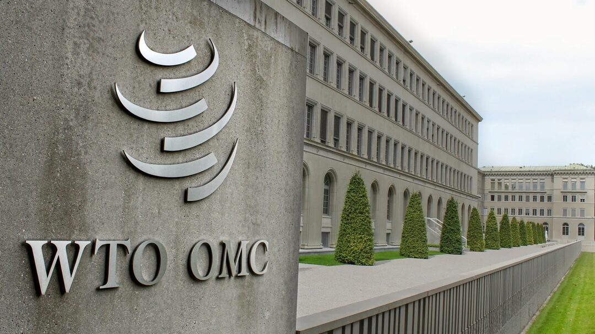
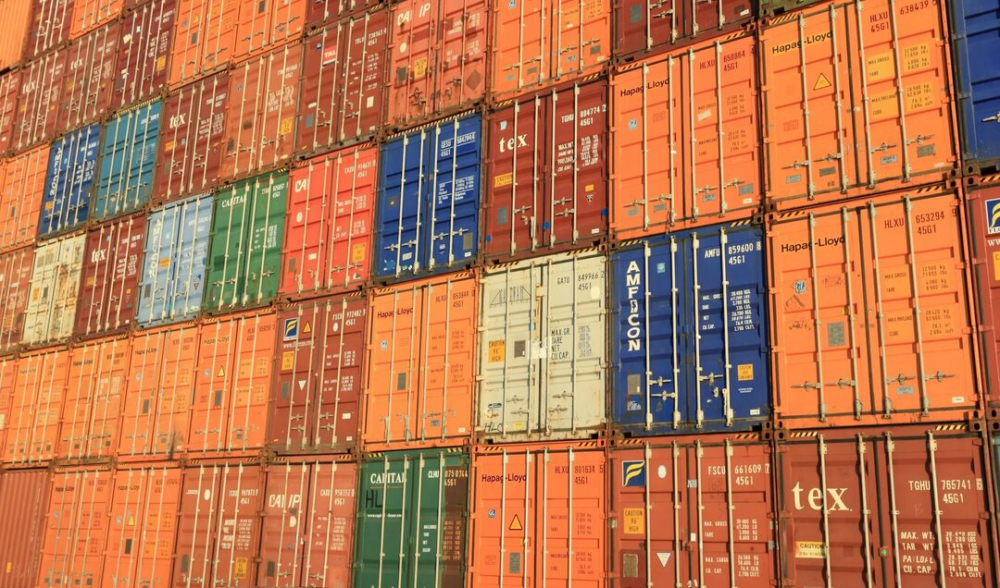
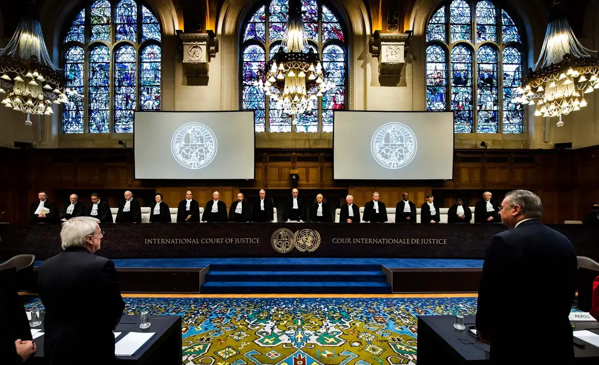

> Recently, the story of Yang Jinwen, a Zhejiang University graduate, has gone viral online. At the graduation ceremony, he declared, "Go where the motherland needs you most," and then promptly applied to study for a Master of Laws in the United States. Many netizens have criticized him as a "two-faced person," focusing on emotional reactions rather than the substance of his decision. While we cannot verify his true intentions, and perhaps it is unnecessary to do so, studying law in the U.S. is indeed aligned with the idea of "going where the motherland needs you most." <!--more-->

## Why Studying Law Abroad Counts as "Going Where the Motherland Needs You Most"?

China joined the WTO in 2000. Before that, domestic laws were almost entirely disconnected from the global legal system. Even after joining the WTO, legal education in China has primarily focused on domestic law, with international law and private international law receiving only cursory attention. During my university years, professors openly stated that these subjects would be of little use to students in the future, advising us to just skim through them. This has been reflected in reality: in the over 20 years since joining the WTO, China's progress in international legal affairs has been minimal and severely mismatched with its economic development.

During a training session at Northwest University of Political Science and Law last month, the instructor shared some striking statistics:

1. Out of the 700,000 lawyers in China, **fewer than 10,000** are capable of handling international legal practice.  
2. Nationwide, **fewer than 300 lawyers** can participate in overseas litigation or arbitration hearings, and **fewer than 30** can provide international legal services in dispute resolution bodies like the WTO.  
3. In 2023, China's total import and export volume reached 41.76 trillion yuan, of which **95% of transactions had to rely on foreign legal rules**, with disputes being resolved by foreign courts or arbitration institutions.  
4. Among the 5% of cases resolved by domestic courts and arbitration institutions, over 95% involved disputes within mainland China, Hong Kong, Macau, and Taiwan.  
5. In recent years, Chinese companies have faced a **loss rate of over 95%** in overseas litigation or arbitration related to import and export trade.  
6. In United Nations agencies, the proportion of Chinese civil servants is **less than 1/15 of China's contribution to the UN budget**, and **almost none** are involved in legal affairs. China has little participation or voice in the formulation of international legal rules.  

> As the saying goes, "Know your enemy and know yourself, and you can fight a hundred battles without disaster." However, in reality, there are too few people in China who understand Anglo-American law or foreign legal systems. Even fewer are capable of skillfully using foreign legal rules to confront foreign governments, businesses, and institutions. With just a slight application of legal rules, Western countries can cause significant losses to China's import and export trade.  

A case in point is a Hong Kong company whose mainland subsidiary was added to the U.S. Commerce Department's Entity List. To challenge this, the company searched across China and Hong Kong for a competent lawyer but found none. Ultimately, they had to hire an expensive U.S. lawyer to sue the U.S. Commerce Department, only to lose the case.

## China's International Rule of Law Has a Long Way to Go, Urgently Needing to Catch Up on Foreign Law

### Domestic Legislation is Relatively Backward

In terms of legislation, most of the major legislative achievements have only been introduced in recent years, and the rules are still quite rudimentary. Compared to the centuries-old international legal frameworks of Europe and the U.S., which consist of hundreds or thousands of provisions and countless case precedents, China's efforts are just beginning.

1. **Export Control Law** (adopted at the 22nd meeting of the Standing Committee of the National People's Congress on October 17, 2020)  
2. **Anti-Foreign Sanctions Law** (adopted at the 29th meeting of the 13th National People's Congress on June 11, 2021)  
3. **Regulations on the Unreliable Entity List** (Ministry of Commerce Order No. 4, 2020)  
4. **Regulations on the National Technology Security List** (Ministry of Commerce, August 2019)  
5. **Measures to Block the Improper Extraterritorial Application of Foreign Laws and Measures** (Ministry of Commerce, January 9, 2021)  

### The External Legal Environment is Unfavorable to China

- **Increased Compliance Controls in International Economic Activities**  
  Due to the impact of the COVID-19 pandemic and the Russia-Ukraine conflict, the global economic environment has deteriorated, trade frictions have intensified, and trade protectionism has rapidly risen. Many countries and regions have tightened compliance controls on international economic activities, strengthened the legality review of international trade, and increased penalties for non-compliant transactions. The uncertainty and risks in international trade have significantly increased.  

- **Proliferation of Long-Arm Jurisdiction Laws**  
  Since 2018, the U.S. has continuously escalated unilateral sanctions, creating trade frictions globally, especially targeting China through long-arm jurisdiction. By issuing a series of trade sanctions and administrative orders, the U.S. has strengthened extraterritorial enforcement, enhanced secondary sanctions, and controlled the export of high-tech products, dual-use items, and key technologies, disrupting supply chains and imposing restrictions. These actions challenge China's fundamental policy of opening up and aim to counter China's international economic cooperation under the Belt and Road Initiative, interfering with China's domestic affairs and economic development.  

- **Deterioration of International Compliance Environment**  
  Since the Russia-Ukraine conflict began on February 24, 2022, the U.S. and its Western allies have formed a sanctions coalition against Russia, prompting Russian countermeasures. This has led to a legal battle of sanctions and counter-sanctions, causing global economic turmoil, high inflation, food and energy crises, social crises, and supply chain disruptions. Multiple risks have converged, worsening the international trade environment and increasing compliance risks. Coupled with the impact of COVID-19, the global economic recovery faces significant resistance, with many countries facing post-pandemic bankruptcy waves, asset restructuring, and cross-border mergers and acquisitions.  

- **Complex Carbon Emission Legal Rules**  
  In response to global climate governance, many countries have linked carbon emission controls to import and export trade, using legal measures to restrict international trade activities of high-carbon industries and the import and export of carbon-intensive products. This has increased transaction costs, raised technical standards for imports and exports, and elevated the level of trade compliance controls, creating numerous institutional barriers for export-oriented economies. The European Union has implemented carbon border adjustment measures since 2023, imposing carbon tax controls on import and export trade.  

### Weak Internal Compliance Management Capabilities

- **Weak Corporate Compliance Capabilities**  
  Chinese export-oriented enterprises face severe challenges in compliance management and governance. Many companies are under pressure to improve their compliance management capabilities, risk management, and dispute prevention efforts.  

> In recent years, the depth and breadth of market economy legalization have continuously strengthened. Countries worldwide have increasingly focused on national economic security, intellectual property protection, social order security, environmental safety, data security, and human rights protection. They have established dense legislative networks to regulate commercial activities and market order, built management mechanisms for commercial activities and market order, strengthened administrative and judicial enforcement of compliance, increased penalties for non-compliant behavior, and expanded the scope of jurisdiction and sanctions against non-compliant entities.  
> **All these factors have significantly altered the external legal and policy environment for China's export-oriented economic development. China's overseas investments and international trade face multiple institutional restrictions from host countries, including legislation, judiciary, administrative enforcement, industry rules, and regulations. The global economy has entered a period of frequent trade frictions and penalties for non-compliance, placing unprecedented compliance pressure on Chinese enterprises engaged in international business. This has introduced many new requirements, changes, and standards for the compliance management and governance of Chinese enterprises' international business activities.**  
> Particularly in recent years, the global economy has experienced significant turbulence, with frequent geopolitical conflicts. The global economy has been deeply affected by the COVID-19 pandemic and the Russia-Ukraine conflict, leading to a slowdown in global economic growth and a rapid rise in trade protectionism. Global governance deficits, security deficits, and development deficits are intertwined, resulting in frequent global risk events.  
> Western countries, led by the U.S., have frequently initiated trade sanctions to shift the risks of domestic economic recession, triggering global trade frictions. Specifically targeting China's opening-up and international economic development, the U.S. and others have continuously issued sanctioning administrative orders, abused long-arm jurisdiction, and expanded the scope and targets of economic sanctions. The legal battles of sanctions and counter-sanctions in the international economic sphere have escalated, significantly increasing variables and uncertainties in international commercial transactions. Both hidden and visible operational risks have emerged, objectively raising the requirements for Chinese enterprises to manage risks and compliance.  

- **Weak Ability to Use WTO Rules**  
  Affected by global economic recession and recovery policies, WTO members have widely adopted legitimate trade restriction measures to protect domestic markets and maintain fair trade. Legal disputes over anti-dumping, anti-subsidy, and trade safeguard measures have frequently occurred. Since 1979, China has consistently faced restrictions from these measures, severely impacting its import and export trade.  

- **Insufficient Initiative in Establishing Emerging Legal Rules**  
  Technological changes have profoundly impacted the global economic order, with increasing integration of technology, finance, and the rule of law. Emerging legal fields such as data law, algorithmic law, and artificial intelligence law have emerged. Technologies like blockchain, the Internet of Things, drones, cloud computing, and big data have entered the scope of legal regulation, becoming new areas of future legal governance. Disputes involving artificial intelligence and mobile internet as carriers have occurred, and new international commercial dispute resolution mechanisms such as online dispute resolution and international commercial mediation have emerged. These developments have generated numerous modern legal issues in export-oriented economic development and international trade cooperation, presenting many new situations and problems in evidence collection and the application of procedural and substantive rules in dispute resolution.  

- **Weak Cross-Border Legal Service Capabilities**  
  The competition for institutional rights in the global economic sphere has intensified, with a growing focus on establishing regional and global international commercial dispute resolution centers. Building strategic hubs for cross-border trade legal interests has become a strategic goal for major economic powers in legal diplomacy.  

- **Weak Ability to Handle 'Legal Wars'**  
  The process of international order transformation is complex and volatile. Countries increasingly rely on international legal services to enhance their international cooperation and competitive capabilities. Legal diplomacy and legal wars have become commonplace in international interactions, making international legal services a crucial force in national cooperation and competition. Developing international legal services has become a national strategic industry for international cooperation and competition.  

> There are numerous examples of this: the Meng Wanzhou case; the Huawei and ZTE cases; China's grounding of Boeing 737 Max 8 and compensation claims; the legal issues facing the C919 aircraft; the MH370 disappearance compensation case; the South China Sea arbitration case; the Xinjiang cotton case; the COVID-19 origin tracing and compensation claims; and the legal response to Japan's nuclear wastewater discharge. These are all legal battles initiated by other parties. However, due to China's shortcomings in international rule of law, it often has to resort to political, diplomatic, or other means at great cost, resulting in losses far exceeding gains, while the other parties incur almost no costs.  

### Severe Shortage of International Legal Talent

As of November 2023, 218 law firms from 22 countries have established 282 representative offices in China, while Chinese law firms have set up 180 branches overseas. Foreign arbitration institutions are allowed to operate in China. Currently, there are 677,000 practicing lawyers in China, 39,000 law firms, and 13,000 grassroots legal service institutions. Rough estimates suggest that fewer than 10,000 lawyers are capable of handling international legal practice, fewer than 300 can participate in overseas litigation or arbitration hearings, and fewer than 30 can provide international legal services in WTO dispute resolution bodies. There is a severe shortage of leading international legal talent, and the competitiveness of China's international legal services is significantly lacking. The scale, business layout, and quality of China's international legal services are neither commensurate with its status as a major country nor aligned with the practical needs of comprehensive opening-up. China is a major demander of international legal services but a major supplier of such services. The field of international legal services continues to expand, with new forms of international legal services emerging. The international community is increasingly competing to become the primary supplier of international commercial legal services and the preferred location for dispute resolution. In the practice of international legal services, China faces the "three highs" problem, urgently needing to accelerate governance and reform to meet the needs of China's major country diplomacy, comprehensive opening-up, and high-quality Belt and Road construction.  

> Most of the above content is derived from lectures by Professor Wang Han, a second-level professor at Northwest University of Political Science and Law.