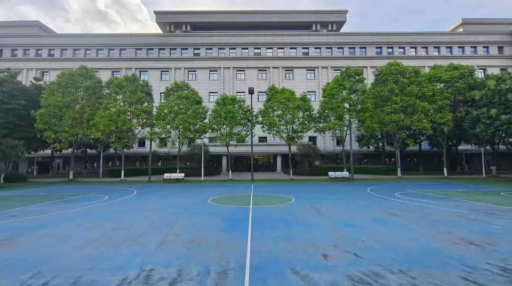

Recently, I was seconded to participate in the case review work of the political and legal system. The main task of my working group was to review appeal cases handled by the prosecutorial organs, most of which were legal and litigation-related petition cases. We spent a full five days reviewing 70 cases handled by the prosecutorial organs. <!--more-->

## Types of Prosecutorial Appeal Cases

Prosecutorial appeal cases mainly include three categories: criminal appeals, civil appeals, and administrative appeals.

### Criminal Appeals

1. Appeals against the decisions of the People's Procuratorate;

2. Appeals against legally effective criminal judgments and rulings of the People's Court, unless otherwise stipulated;

3. Appeals against the public security organs' decisions not to file a case.

### Civil Appeals

1. Legally effective civil judgments, rulings (limited to rulings of non-acceptance and dismissal of lawsuits), and mediation agreements, where the parties have applied to the People's Court for retrial, and the court has rejected the retrial application, or failed to make a ruling on the retrial application within the time limit, or the retrial judgment or ruling made after the court decided to retrial is obviously erroneous;

2. Cases where the parties believe that the judges in the civil trial process have committed illegal acts;

3. Cases where the parties believe that the People's Court's civil execution activities are illegal.

### Administrative Appeals

1. Legally effective administrative judgments, rulings (limited to rulings of non-acceptance, dismissal of lawsuits, and non-filing), and mediation agreements, where the parties have applied to the People's Court for retrial, and the court has rejected the retrial application, or failed to make a ruling on the retrial application within the time limit, or the retrial judgment or ruling made after the court decided to retrial is obviously erroneous.

2. Cases where the parties believe that the judges in the administrative trial process have committed illegal acts, except where the People's Court has accepted and is reviewing the parties' objections, applications for reconsideration, appeals, or lawsuits;

3. Cases where the parties believe that the People's Court's administrative execution activities are illegal, except where the People's Court has accepted and is reviewing the parties' objections, applications for reconsideration, appeals, or lawsuits.

## Reflections on Prosecutorial Appeals

### Case Resolution is the Core

During this review process, we encountered a controversial case. A judge in our group was puzzled by the handling of a criminal appeal case, where the majority of prosecutors, including the handling prosecutor, believed it constituted a criminal offense, but the case ultimately maintained a non-prosecution decision through criminal reconciliation. Several of us re-examined the case files and invited other criminal judges and prosecutors to discuss, but no consensus was reached. To be cautious, I consulted the head of the case management department of the prosecutorial organ and the handling prosecutor for further information. I also sought advice from an alumnus who is the head of the criminal prosecution department of another city's procuratorate. After synthesizing various opinions, I tend to believe that this case was not only handled correctly but also very well. This process gave me a deeper understanding of handling criminal appeal cases.

1. **Criminal cases are primarily about evidence**. In cases where facts are unclear and evidence is insufficient, the prosecutorial organ should prioritize non-prosecution due to doubt, especially under the concept of cautious arrest and prosecution. Arrest and prosecution should be avoided if possible. In some criminal cases, increasing investigative efforts and costs afterward may not yield effective results, and the case may never be solved.

2. **Controversies in criminal cases are normal**. Including the case we encountered, there were significant disputes between charges and between guilt and innocence. If the prosecutorial organ insisted on prosecution, there might be a verdict of not guilty, leading to a series of follow-up issues such as state compensation.

3. **The purpose of handling appeals is to resolve disputes**. In criminal cases, besides pursuing punishment for crimes, it is also important to consider how to repair social relations and reduce social conflicts through case handling, achieving dispute resolution. Especially in economic crime cases, the core demand of victims is often economic interests rather than punishing the crime. Punishing the crime excessively may not benefit the victims.

4. **Economic crime cases are very difficult to handle**. Due to the intertwining of civil relationships, the boundary between economic disputes and criminal cases is often unclear. Some evidence may never be fully recovered due to poor preservation by victims or difficulty in collection. Even if the suspect's behavior meets certain criminal characteristics, there may still be issues with incomplete evidence chains.

> These are actually very basic principles. The core reason for the controversy in this case is that similar cases can easily give the impression of "buying punishment with money," where the suspect compensates the victim to reach a settlement, and the prosecutorial organ no longer pursues the suspect's responsibility. However, in specific cases, due to the influence of multiple factors mentioned above, whether the case can be successfully handled remains a big unknown. In such cases, the prosecutorial organ's choice to facilitate a settlement between the parties is actually the best option.

### Abuse of Litigation and Petitions is Still Prominent

In this review, we found many cases involving persistent abuse of litigation and petitions. Some minor issues led to parties repeatedly harassing courts at all levels, turning a simple dispute into over 20 legal documents. Ultimately, these issues stemmed from the parties themselves. Additionally, some parties, highly suspected of being lawbreakers, exploited legal loopholes, but under the current judicial system, these behaviors cannot be effectively addressed. Here are a few examples:

1. A party sued a merchant and a phone manufacturer over the advertisement "fastest 30-minute charge," going through first instance, second instance, retrial, and prosecutorial appeal procedures. After three years, the party still refused to accept the outcome and continued to petition. The core demands were: first, that the phone's charging test was conducted in a laboratory environment, differing from actual usage scenarios; second, that the term "fastest" violated advertising laws.

2. A party, a 1970s government official, later transferred to a subordinate enterprise as a general manager. During the 1990s state-owned enterprise reform, the party transitioned from a state-owned enterprise official to a private enterprise employee. Approaching retirement, the party initiated civil and administrative lawsuits for 12 years, aiming to retire as a civil servant, claiming to have been a state-assigned university graduate.

3. A group of pure gamblers, lured by others to gamble abroad multiple times, incurred massive debts. While gambling debts are not legally protected, since all gambling occurred abroad, the public security organs could not gather evidence of illegal activities. These cases often entered the judicial system as "private lending disputes," but were essentially false lawsuits. Due to insufficient evidence, these parties could act with impunity.

### Prosecutorial Case Handling is Generally Robust

Due to its unique position, the prosecutorial organ indeed has distinctive features in case quality control.

1. **Legal Professionalism**: Prosecutorial staff typically possess high legal expertise and practical experience, having undergone rigorous selection and training to accurately understand and apply the law. Especially since prosecutorial work is relatively specialized, many prosecutors have been handling the same type of cases for decades, making them experts.

2. **Strict Case Handling Procedures**: The prosecutorial organ follows strict legal procedures in case handling, ensuring every decision is based on thorough investigation and review. As a legal supervision organ, it holds itself to higher standards. For example, in court case review rules, there are general error cases and major error cases, and finding some error cases is normal. However, in the prosecutorial process, even a minor flaw is considered unacceptable and subject to accountability, with wrongful cases strictly limited to major miscarriages of justice like the Hu Gejiletu case.

3. **Internal Supervision Mechanisms**: The prosecutorial organ has internal supervision mechanisms, such as the case management department, to oversee the case handling process, ensuring prosecutors perform their duties lawfully and preventing abuse of power and illegal acts. For instance, in document proofreading, typos in court judgments are common, with a significant proportion of case files containing errors, but this is much rarer in prosecutorial documents.