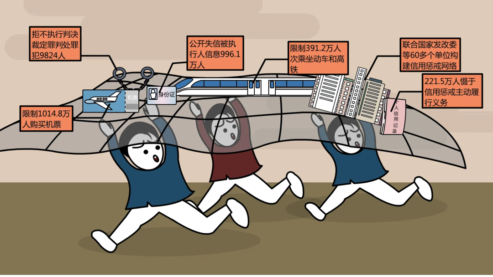
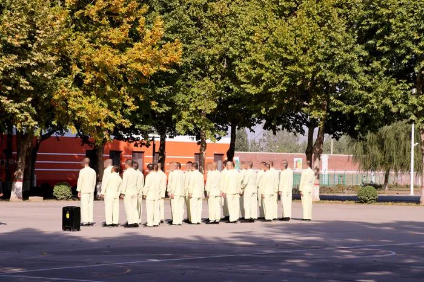

二十届三中全会关于完善中国特色社会主义法治体系部分提出了很多改革举措，其中，在健全公正执法司法体制机制方面，有多项重点改革任务，包括审执分离改革。<!--more-->

> （35）健全公正执法司法体制机制。健全监察机关、公安机关、检察机关、审判机关、司法行政机关各司其职，监察权、侦查权、检察权、审判权、执行权相互配合、相互制约的体制机制，确保执法司法各环节全过程在有效制约监督下运行。**深化审判权和执行权分离改革，健全国家执行体制，强化当事人、检察机关和社会公众对执行活动的全程监督**。完善执法司法救济保护制度，完善国家赔偿制度。深化和规范司法公开，落实和完善司法责任制。规范专门法院设置。深化行政案件级别管辖、集中管辖、异地管辖改革。构建协同高效的警务体制机制，推进地方公安机关机构编制管理改革，继续推进民航公安机关和海关缉私部门管理体制改革。规范警务辅助人员管理制度。坚持正确人权观，加强人权执法司法保障，完善事前审查、事中监督、事后纠正等工作机制，完善涉及公民人身权利强制措施以及查封、扣押、冻结等强制措施的制度，依法查处利用职权徇私枉法、非法拘禁、刑讯逼供等犯罪行为。推进刑事案件律师辩护全覆盖。建立轻微犯罪记录封存制度。

相较 2014 年十八届四中全会的表述，“推动实行审判权和执行权相分离的体制改革试点”，这次提出的审执分离改革，站位更高，配套更多，任务更重。

## 审执分离的概念

1. **审判、执行工作分开**

2000 年以来，审执分离就一直是法院的重点改革方向。在当时，审执分离被认为是人民法院内部将审判工作与执行工作分开，审判员负责审判，执行员负责执行的职责分开。目的是改变以往审执合一，权力过于集中的制度。2000 年 9 月最高人民法院出台《关于改革人民法院执行机构的通知》提出要“积极探索执行裁判权和执行实施权相分离，裁判人员和执行人员分工负责、互相配合、互相制约的新机制。”

2. **审判权、执行权分开**

2014 年以来，审执分离进行新的探索阶段，这个阶段一些地方法院在探索过程中，主要实施的方式是将执行工作中涉及审判权行使的部分进一步分离开。包括执行异议复议、执行监督、案外人异议程序等，均交由审判庭负责，执行部门只专注于裁判结果的执行。

3. **审判权、执行权交由不同机构负责**

在理论界，审判权、执行权交由不同机构负责早有呼吁。当前我国法院行使的执行权，实质上属于民事执行权，刑事执行部分早已分别由监狱、看守所和社区矫正等机构实施，后者实施过程更为复杂，权力也更为分散，但总体上以司法行政机关为主，公安机关为辅。理论界一直有声音呼吁将法院的民事执行权转由司法行政机关负责或者单独设置国家民事执行机关来负责。但由于民事执行权事关重大，对于维护司法权威具有重要意义，从法院划出的难度比之反贪、反渎职能从检察机关划出要大得多。之前很多时候法院在表述审执分离时，基本回避这个问题。

## 改革的目的

### **解决执行难问题**

从十八届三中全会提出“全面深化改革”以来，以问题为导向便成了改革的最显著特征，不能为了改而改。重大改革一定是要带有解决重大问题的目的性而来。

2014 年审执分离改革提出的重大背景就是“执行难”问题，十八届四中全会提出“切实解决执行难”的目标，提出要制定强制执行法，规范查封、扣押、冻结、处理涉案财物的司法程序，加快建立失信被执行人信用监督、威慑和惩戒法律制度，依法保障胜诉当事人及时实现权益。

此后最高法院更是提出用两到三年时间基本解决执行难问题，也就是在这之后，“老赖”“黑名单”等词汇，成为社会关注热点。

在这期间，法院的执行工作基本上把能够拉进来的政府部门都聚拢到一起，形成工作合力，包括房、车、存款、股票、基金等财产联网查封、冻结、扣押，机票、高铁、酒店、出入境等联合惩戒限制机制得到建立健全，绝大多数能够想到、能够做到的执行措施，都做到了尽力而为。

毫无疑问，经过三年“基本解决执行难”攻坚，以及之后多年“切实解决执行难”工作，整体上执行难问题得到根本改善。

总言之，到 2024 年当下，“执行难”问题虽然一定程度仍然存在，但就当前执行能力而言，恐怕很难再作为继续深化审执分离改革的头号目标。

### **健全执法司法监督制约体制机制**

那么，继续深化审执分离的动力是什么？我想还是从十八届四中全会和二十届三中全会两个报告中找答案比较合适。

在十八届四中全会报告中，审执分离改革是作为优化司法职权配置的工作提出，解决执行难的措施是作为加强人权司法保障的措施提出。而在二十届三中全会中，审执分离改革是作为健全公正执法司法体制机制的内容提出。相较而言，当下提出的审执分离，核心目的是对司法权力行使的规制。

- **制约监督**

本次报告提出的“健全监察机关、公安机关、检察机关、审判机关、司法行政机关各司其职，监察权、侦查权、检察权、审判权、执行权相互配合、相互制约的体制机制”，相较十八届四中全会报告，增加了监察机关和监察权，并且从字面上依然是五个机关、五种权力，很容易让人感觉应该是五个机关对应五种权力，即监察机关-监察权，公安机关-侦查权，检察机关-检察权，审判机关-审判权，司法行政机关-执行权。但实际上，监察、检察、公安都有侦查权，公安、审判、司法行政机关都有执行权。或许五个机关对应五种权力是以后改革的方向，但就当下而言，应该还不至于如此。

不过，法院的民事执行工作显然属于执行权，在审执分离的大背景下，改革目标是需要进一步构建执行权与其他权力之间相互配合、相互制约的体制机制。

- **国家执行体制**

国家执行体制是一个新的概念，此前有执行体制、刑罚执行体制的说法。例如，十八届四中全会提出“统一刑罚执行体制”，但事实上刑罚执行体制尚未完全统一，即学界呼吁的公安看守所划归司法行政机关尚未实现。此次提出的国家执行体制，应当是比原来的执行体制、刑罚执行体制更高站位的概念。应当是对民事执行、刑事执行概念的统一。在新的国家执行体制下，民事执行和刑事执行在体制上应该有更密切的统筹联系。最佳方案当然就是两者均由同一部门行使，即便当下一时难以合并，也应该在制度上进行归并管理，否则这个概念就缺乏生命力。

个人认为，国家执行体制的构建，可以考虑将各级法院的执行局单列管理。例如，将 ×× 市中级人民法院执行局变更为 ×× 市执行局，与法院合署办公或者由法院代管。

- **执行监督**

本次报告提出要强化当事人、检察机关和社会公众对执行活动的全程监督，这块内容一直是执行工作中的难点。我们在日常工作中能感受到，检察机关对于法院的监督有一个从刑事诉讼监督到民事审判监督、行政审判监督和执行监督力度逐步弱化的过程，多数地方检察院对法院的执行活动的监督几乎很难发挥到作用。在当事人方面，当事人对执行活动的监督，也主要体现在执行信访过程。至于社会公众对执行活动的监督，更是实践中难上加难的问题。

特别是现在法院系统在力推“交叉执行”工作。虽然从法院内部来看，“交叉执行”能够克服地方保护主义，有效防止权力、关系、人情干扰，遏制滥用执行权乃至执行腐败问题。但对于监督工作而言，“交叉执行”又给检察机关出了一个大难题。按照当前司法体制，检察对法院的监督是基于地域的，即某县法院办理的执行案件，应该由该县检察院进行监督。但对于某县法院交叉办理的其他县的执行案件，该县检察院还有没有监督动力，就很存疑了。事实上，在行政诉讼监督方面就已经比较明显体现出来。最近这些年很多地方推行行政诉讼集中管辖，在此种情况下，不仅是被集中管辖地区的法院不需要负责行政案件办理，连带同区域的检察院也几乎不用再负责行政诉讼案件监督。至于集中管辖法院当地的检察院，则对兄弟地区发生的行政案件基本没有监督兴趣。这次三中全会报告提出“深化行政案件级别管辖、集中管辖、异地管辖改革。”各地在改革过程中，应该重视这方面问题。

## 审执分离改革的未来

不管是十八届四中全会还是二十届三中全会，都将执行权作为一项单独权力列出，与审判权相并列。可见对于执行权的性质是明确的，即执行权是一项单独权力，而非审判权的附属。

既然做了区分，那就有了新的疑问：执行权是否还属于司法范畴？

这也是一个很值得研究的问题。即在传统法治语境下，执法和司法归属于行政与司法两类不同的权能。传统意义上的“执法”，通常指行政法范畴内的行政执法，而司法则是围绕诉讼为中心的全阶段。包括公安侦查、检察公诉、法院审判、民事执行以及刑事执行等都被列入司法范畴。

但在实践过程中，司法的范围不断扩大，甚至推广到所有公安机关、检察机关、审判机关、司法行政机关。例如，《司法机关内部人员过问案件的记录和责任追究规定》中所称司法机关内部人员，是指在法院、检察院、公安机关、国家安全机关、司法行政机关工作的人员。

基于此，三中全会报告，出现了两类“执法”。一类依然是行政执法，另一类是执法司法中的执法。也就是将上述监察委、法院、检察院、公安机关、国家安全机关、司法行政机关这几个限定机构的活动，统称为执法司法。但具体到监察权、侦查权、检察权、审判权、执行权这五种权力，哪一种属于执法，哪一种属于司法，暂时没有定论。

新的“执法司法”概念，可能是中国特色社会主义法治体系建设中需要着重加强研究、阐释的一个概念。例如，在“科学立法、严格执法、公正司法、全民守法”十六字方针中，人民法院传统上只讲“公正司法”四个字，而一旦将执行权当作执法司法中的执法，那么人民法院不仅肩负公正司法的职责，同样肩负严格执法的责任。在这种情况下，审执分离的问题将变得更为突出。

事实上，在本人多年工作经历中，党内文件已长期将执法与执法司法并用。例如在《中国共产党政法工作条例》中，同时有“执法为民”“执法办案”“执法监督”以及“执法司法工作”“执法司法条件”“执法司法政策”等表述，内容都是表达执法与司法两者之和。此外，党委政法委也设有执法监督部门，负责监督政法单位依法行使职权。此次对执法司法的表述，个人猜测将进一步理顺监察权、侦查权、检察权、审判权、执行权的行使，分类实施更加精准的监督措施。

### 个人建议

总的来说，审执彻底分离应当是大趋势，但面临改革深水区，也并非一朝一夕能成。如果一定要分家，我个人设想可以这样干：

> 1. 在省级司法厅设强制执行管理局，主管全省强制执行工作。
> 2. 在市、县设强制执行局，挂在司法局名下，以垂管为主，接受地方领导。
> 3. 法院系统现有执行人员分流，部分留在法院，补充审判力量，缓解案多人少矛盾。
> 4. 司法行政机关中现有闲置警力分流至强制执行局，补充强制执行力量。
> 5. 执行法官转执行警察，按照现有职务职级直接套转相应警务职务职级，确保待遇不降。

主要原因是目前司法行政系统还是有很多闲置警力的，特别是在戒毒领域。先前就有政协委员呼吁说部分省份戒毒警察与强戒人员比例已经达到 6:1 ，在不少省市，警力闲置更为严重。

> 2023年年初，全国政协委员、安徽省律师协会监事长周世虹从安徽省司法行政部门的戒毒管理机关得知了一组数字：安徽省内，强制隔离戒毒人员已不足200人，全省强制隔离戒毒管理机关和8个强制隔离戒毒场所的干部和机构编制数量却高达1240名。