最近台风格美给湖南造成严重影响。台风中心虽然没有经过湖南，但是台风带来的降水却大量倾泻在湖南。<!--more-->

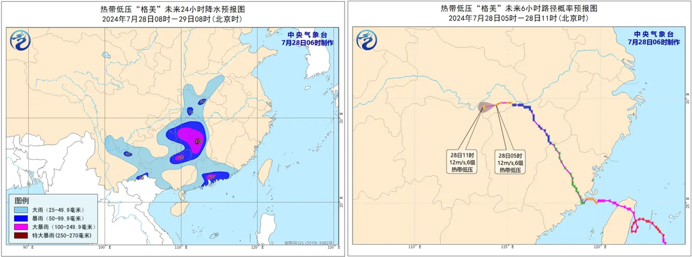

## 台风格美带来的主要灾害问题

> - 衡阳市南岳区寿岳乡岳林村因山洪导致山体滑坡，冲垮一栋民房，致21人被困。经全力救援，共搜救出21人，其中15人不幸遇难，6人受伤。
> - 郴州资兴市11.8万人受灾，1345处道路塌方，通信、电力大面积中断，初步查清共有30人遇难、35人失踪。
> - 湘潭市湘潭县易俗河镇郭家桥新塘村四新堤发生决堤险情。

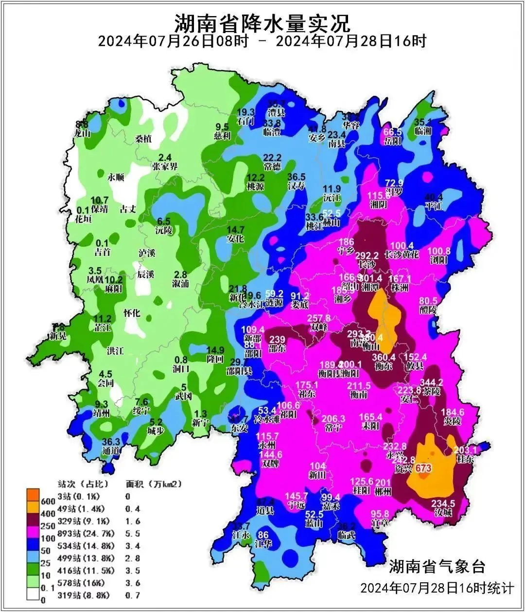

郴州、衡阳、湘潭是这次台风降水影响的主要区域，因此上边发生的三起灾害也是影响最为严重。其他城市内涝、局部泥石流滑坡、农田房屋被淹、道路阻断、通信电力受损等情况亦不在少数。例如，我家乡所在的双峰县县城出现近百年来最严重的内涝。（在上图中，双峰是除了郴州、衡阳湘潭两个降雨带外另一个降雨较为集中的地区）

## 山体滑坡

在台风带来的这些影响中，最严重的问题当属山体滑坡。衡阳和郴州两地发生的人员伤亡事件，都是由山体滑坡造成。

特别是在资兴的这次台风带来的山体滑坡事件，更是让人触目惊心，真实体现了人类在大自然面前的渺小。

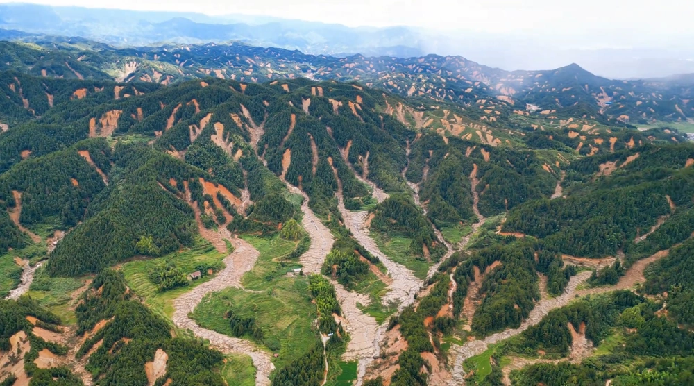

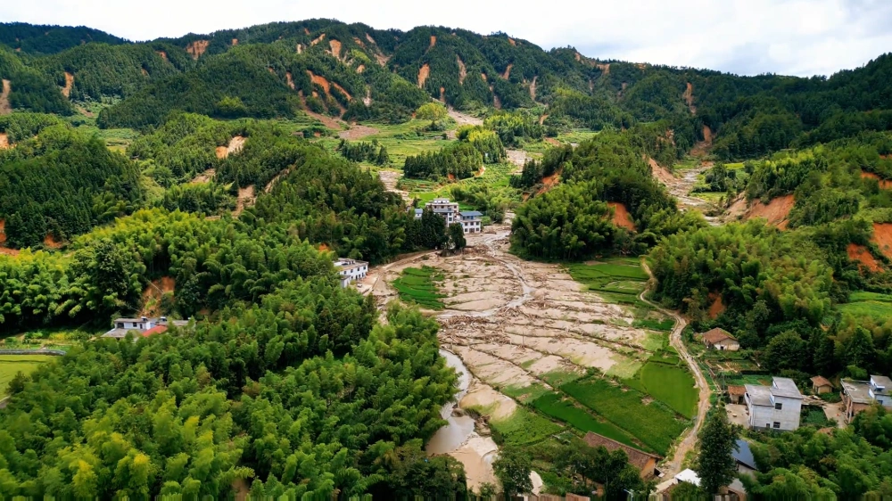

另外，郴州资兴的这次山体滑坡，也刷新了我对山体滑坡的理解，让我重新审视起一个重要概念：丘陵。

## 丘陵

中学地理书上，说湖南大多是丘陵地区。但我直到 2006 年第一次看到谷歌卫星地图，才真正知道什么叫丘陵。此前我对丘陵毫无概念，感觉家乡就是纯山区，丘陵是个啥，根本不懂。

根据个人经验，我觉得湖南的丘陵可以分成多个类型。如下图，以湘乡周边为例。

1. **老年丘陵**。图片中间部分，涟水周围已经几乎找不到丘陵痕迹，只有零星 10 米以内的小土坡还能让人回想起这里曾经是丘陵。  
2. **中年丘陵**。图片左边部分，是已经高度成熟的丘陵，相对高差在 20-30 米左右，如果需要城市建设，随时可以将这些小山坡推平。  
3. **青年丘陵**。图片右边部分，是山脉庇护的丘陵，相对高差基本在 50-100 米以上，目之所及皆是山，生活在这些地方实质体验跟山区别无二致。

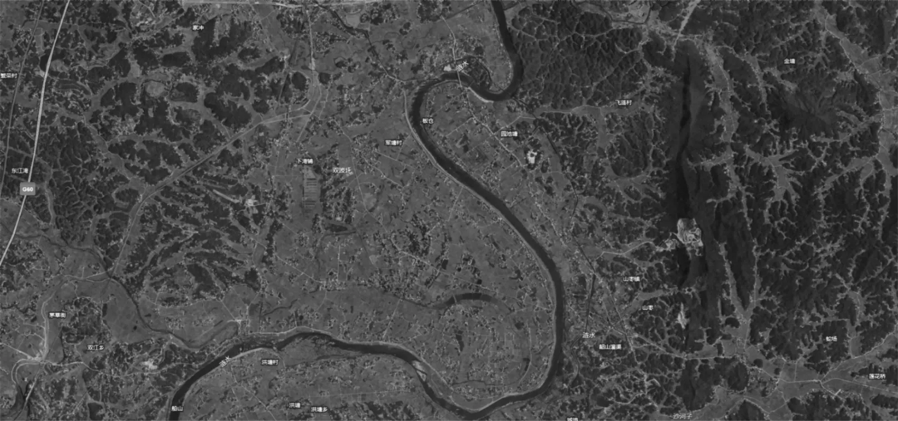

### 老龄丘陵

丘陵经过亿万年雨水冲刷，已经无限趋近于平原。

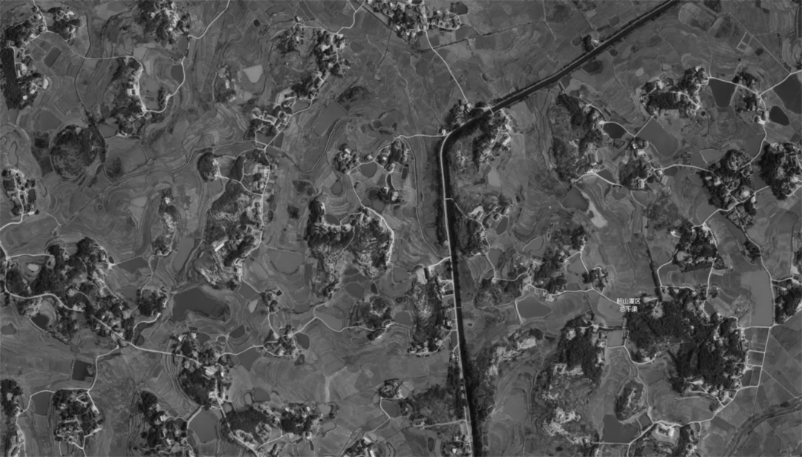

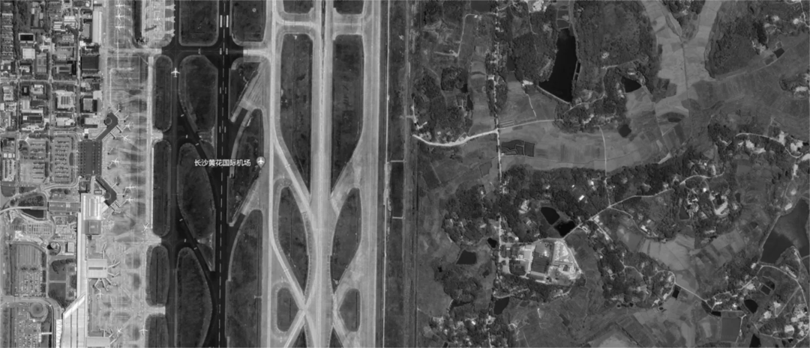

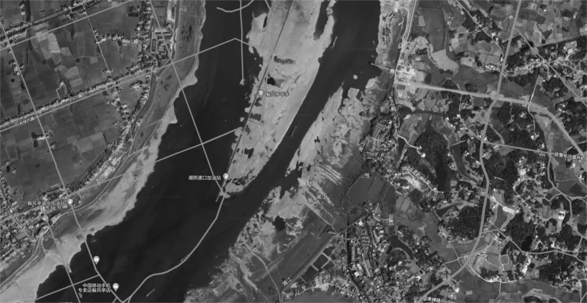

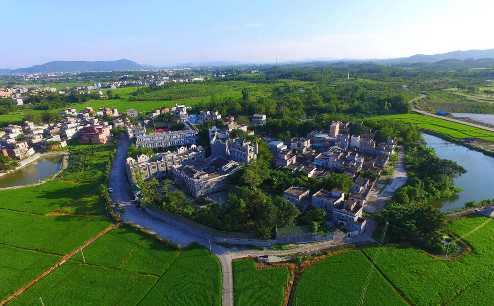

### 中年丘陵

丘陵遍布，大部分保留部分山体特征，目之所及都是小山坡。

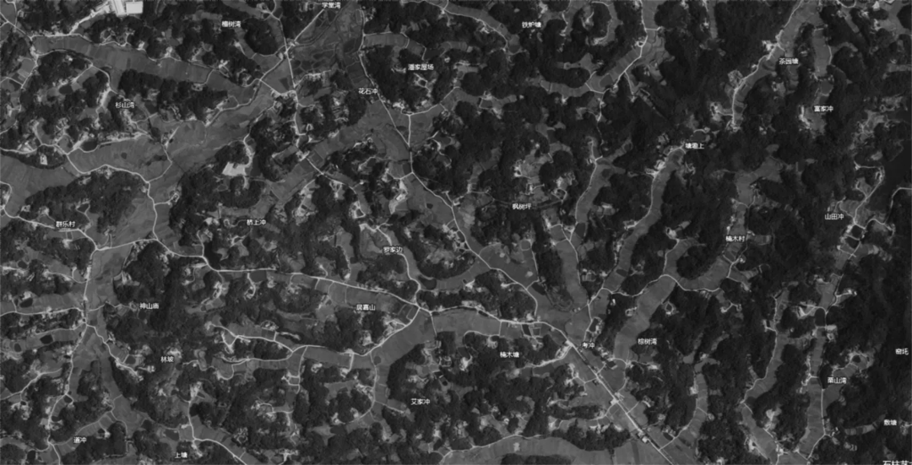

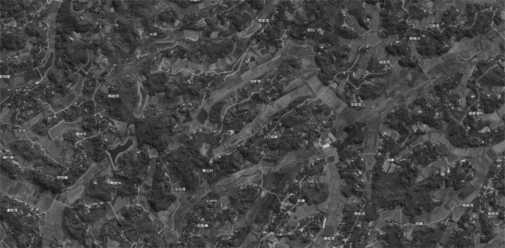

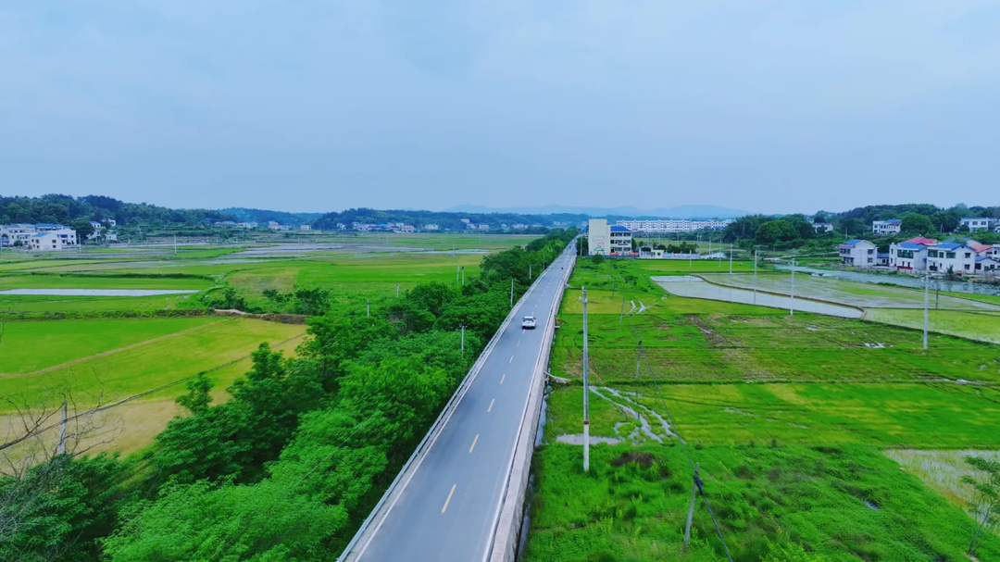

### 青年丘陵

不看卫星地图，跟山区没区别，目之所及都是山。

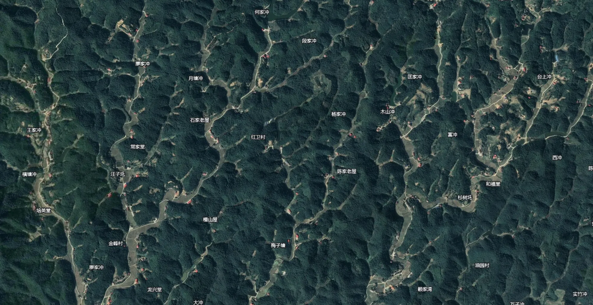

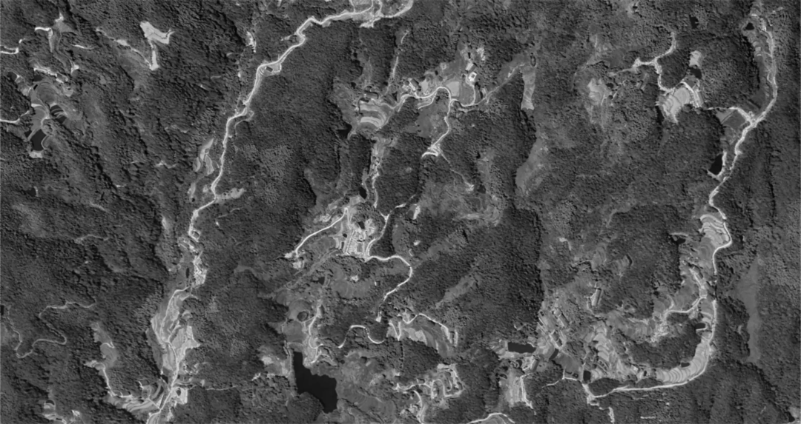

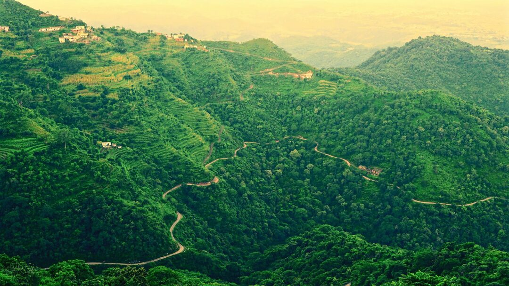

## 结论

毫无疑问，丘陵主要靠雨水冲刷形成。在全国板块构造最稳定的湖南，在几乎没有经历过地震的这块土地上，唯一能快速改造地貌的只有雨水这一个选项。

大山冲刷成小山，小山冲刷成土坡，土坡冲刷成平地。这过程中就是无尽的山体滑坡。

只是恰好郴州这次大规模山体滑坡被直观拍摄到。而这种景象，在亿万年历史长河里，其实一直都是常态。

另外，这次我老家房屋后方也遇到滑坡情况，屋后几块梯式菜地，由于常年没人打理，雨水积蓄在菜地里边，把菜地边缘泥土给冲刷了出来，堵了排水沟。

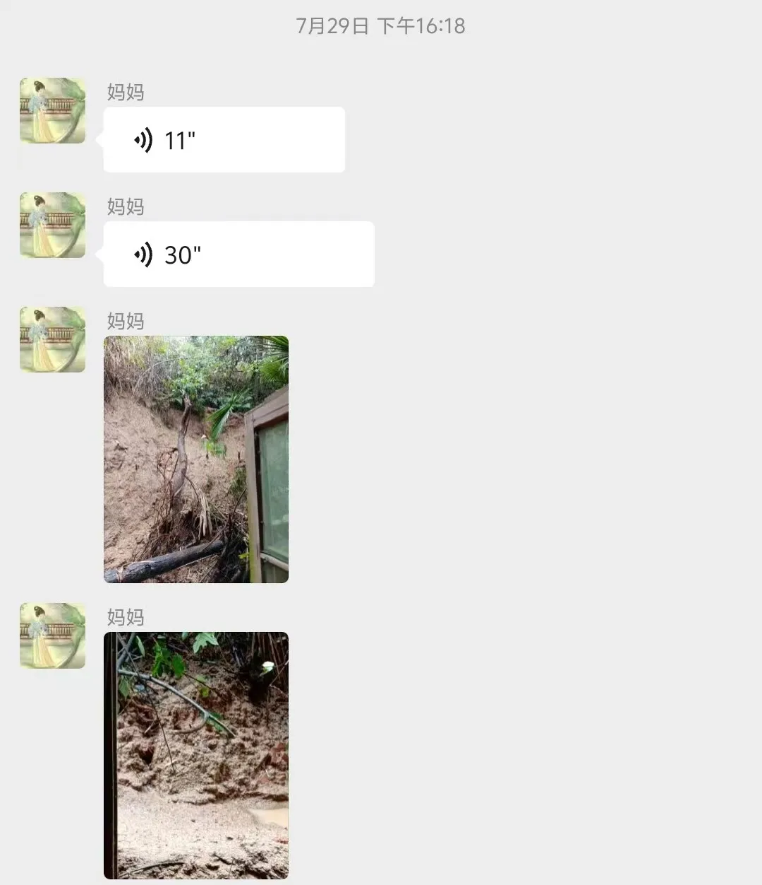