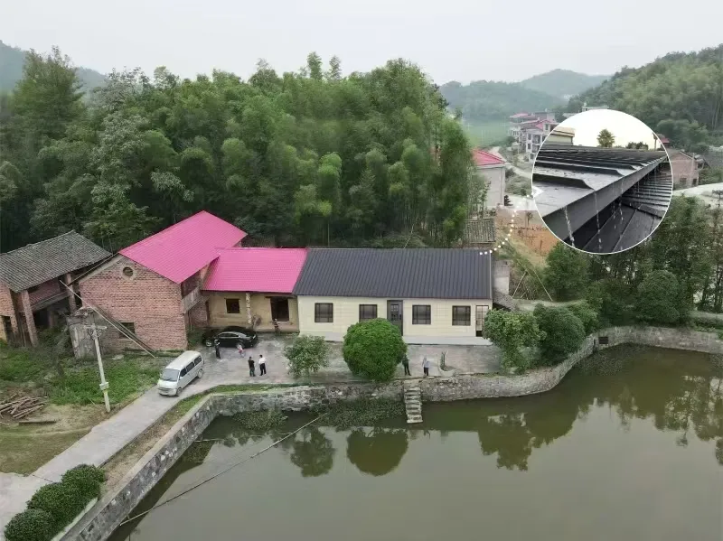
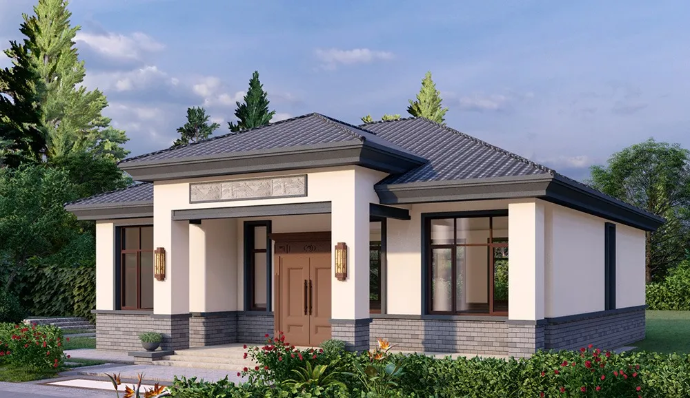

After my father-in-law passed away in 2019, my mother-in-law lived with us for just over a year before returning alone to her hometown. Now in her 70s, she is fortunate to be in relatively good health and can manage living on her own. Additionally, thanks to my two brothers-in-law who work in the area, they can often help out at her place when needed. <!--more-->

The house my mother-in-law lives in is a two-story red-brick building constructed around 2000. While the interior has been painted, the exterior walls remain bare. Although it's a two-story house, the second floor is largely unused, with unpainted rooms that have been collecting dust for years.

This situation is largely due to traditional rural attitudes. Since my wife has only sisters and no brothers, everyone felt there was no need to invest much in the house. For a long time, my in-laws rotated living among their daughters' homes, which we considered the best arrangement. After all, it's hard to feel at ease with elderly parents living alone.

Currently, my mother-in-law is unwilling to move back to the city and prefers to live a simple life in her hometown. However, the house is somewhat dilapidated. While the interior is still passable, with all necessary appliances and facilities in place, and a new bathroom added a few years ago, the exterior leaves much to be desired. So, during the New Year, she proposed renovating the house.

## Renovation

My eldest brother-in-law is a man of action. Shortly after the New Year, he brought a friend from a design institute to take measurements and come up with a renovation plan. The main idea was to tear down the long-neglected second floor and convert the flat roof into a traditional pitched roof.

However, this plan had a significant issue: my mother-in-law insisted that the house should be taller than the one on the right (left side in the picture). She believed that the original house was in the "Green Dragon" position and must adhere to the principle of being higher on the left and lower on the right. The initial two-story design was also intended to meet this requirement.

## Rebuilding on the Same Site

Due to prolonged disputes over the renovation plan, a decision was delayed. Consequently, a new proposal emerged: rebuilding on the same site. This plan involved no longer sharing a wall with the neighboring cousin's house, relinquishing the shared central hall, and ceding an additional meter of space to construct a new single-story house.

While this plan didn't address the "Green Dragon" position issue, it eliminated the need to consider "feng shui influences" since the new house would no longer be connected to the cousin's property.

## Construction Costs

The estimated cost for renovation is around 250,000 yuan, while rebuilding would cost approximately 500,000 yuan.

The main challenge lies in the distribution of expenses. Given that each family has its own difficulties, it took several discussions to reach a satisfactory arrangement for everyone.

The preliminary plan is to start construction soon, aiming to move into the new house before the New Year. However, given the current economic climate and each family's financial situation, there might be some pressure in securing the funds. It seems likely that the project will be postponed until next year.