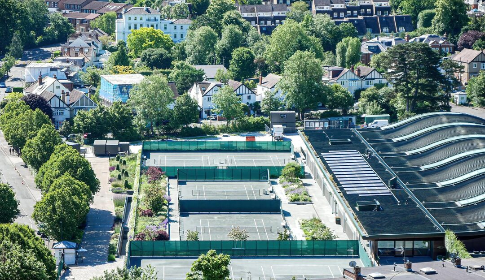

我向来很少就没有定论的案件发表看法，简单搜索下，上一次写这类文章还是在 2011 年 （ [《当事人不应该以攻击法院和法官作为自己败诉后发泄的方式》](https://lawtee.com/article/2011-09-29-court-2/)）。无他，自己不是当事人或者办案人员，对案情分析总有偏颇，根据单方提供信息或者网上一鳞半爪的真相，无法客观分析，只能是被信息提供者带着往沟里跑。<!--more-->

剩余极少数能够拿来被讨论的案件，必然是有着异乎寻常之处，比如最近河南发生的这起骇人听闻事件，就很不寻常。

---

## 事件基本情况

### 发案情况
8月12日上午，郾城区法院发布关于王佳佳法官依法办案惨遭杀害情况的通报。通报称，7日傍晚，该院立案庭副庭长、一级法官王佳佳被犯罪嫌疑人党某某行凶报复，不幸遇害。据公安机关侦查，行凶者系王佳佳所办道路交通事故损害赔偿案件的原告党某某（男，50岁，漯河市城区居民，未婚）。8日3时许，公安机关在党某某家中将其抓获，被抓获时党某某已畏罪服毒，处于昏迷状态，经送医治疗已无生命危险。目前案件仍在进一步侦办中。通报显示，党某某因一起发生于今年4月4日的交通事故，双方和解未成，于7月4日向郾城区法院提起诉讼，此案由王佳佳法官承办。判决后，党某某对王佳佳法官未全部支持其诉讼请求心生不满，未通过法定程序寻求解决，于8月7日18点左右持凶器进入王佳佳法官居住的小区地下车库伺机作案，实施上述犯罪行为。

### 原案情况
2024年4月4日，党某某驾驶的两轮电动车（购于2021年，价格1800元）与李某某驾驶的小型客车发生轻度碰撞，造成党某某左踝关节处、左腕关节处轻微损伤。经交警部门事故责任认定，李某某负事故全责，党某某无责任。因双方和解未成，2024年7月4日，党某某向我院提起诉讼，请求判令被告李某某和李某某投保的某财产保险公司赔偿其医疗费等各种损失18832.93元，经党某某申请，当地司法局为其指定了援助律师。此案由王佳佳法官承办，经公开开庭审理，根据党某某在交通事故责任认定书上签字确认的损失范围以及双方提供的证据，对党某某主张的医疗费、施救费等损失全部予以支持；因其住院29天中的后14天并未实际住院，医嘱仅开具1盒口服止痛胶囊和3盒外用消痛贴膏，结合交警部门认定党某某伤势轻微及被告的答辩意见，故酌定按15天计算住院伙食补助费、营养费、护理费、误工费、交通费；对缺乏证据证明的其他财产损失请求依法不予支持。遂于7月23日判令某财产保险公司在交强险责任限额内赔偿党某某各项损失9384.89元。

---

## 非常因素

### 案涉金额与谋杀结果之反差  
原案最引人注目的莫过于案件中的金额。按网传说法，一般是 9000 与 12000 的价差，至多则是 9000 与 18000 的价差。即当事人认为，案件法官少支持了他 3000 - 9000 元人民币，因此而泄私愤谋杀法官。

按当地人均收入算，2023 年漯河全体居民人均可支配收入 31636 元，农村居民人均可支配收入 23036 元，案涉金额差距大概是居民个人年收入的 10-30% ，如果当事人是农村居民，则是年收入的 13-39%。

### 当事人之间身份之反差 
原案是普通民事诉讼案件，按照民事诉讼一般原理，原被告双方在诉讼中为平等地位。但实质上，在很多民事诉讼活动中，当事人地位却因其社会地位的区别，不可能实现平等。实务中也早已注意到这类问题，比如劳动纠纷中，法律直接偏向于保护劳动者。而当下的道路交通事故人身损害赔偿纠纷，其实也很需要对受害人给予特殊保护。无它，只因大多数交通事故案件中，实际争议双方为受害人与保险公司，而众所周知我国保险公司绝大部分为国有特大型企业。

> 我一直觉得，我国法律中受害人赔偿理论还是过于保守，在民事案件中认为赔偿与损失应当严格对等，在刑事案件中认为国家给予加害人惩处即可部分补偿受害人损失，惩罚性赔偿则几乎没有空间。这种保守观点实质上是对受害者的二次伤害，特别是在交通事故案件中，这种问题更为明显。

### 案后社会舆论与官方定调之反差 
这个法官受害案之所以持续引发社会关注，案后舆论风向是重要因素，即官方通报和官方新闻稿与社会舆论之间存在巨大鸿沟。

一般来说，多数刑事案件发案后，官方通报都是慎之又慎，尽一切可能简化通报内容，防止敏感群体产生角色代入。但该案直接由法官所在法院进行通报，并用大量篇幅试图营造一个偏执当事人恶意杀害完美法官的印象。同时在官方新闻稿中，进一步将法官营造为理想化的社会精英形象。这些都无疑挑战了广大无产阶级的敏感神经。

---

## 个人看法

作为同行，我对法官遭遇是同情的，谁都不想在工作中遇上这种事、这类人。但需要注意的是，这种事、这类人之所以出现，恐怕也不能说与法律行业完全无关。

### 交通事故赔偿本身难以做到公平公正

一般交通事故案件责任是由行政主导进行划分，在事故责任划分后，事故双方就已经知晓大致结果。而交通事故赔偿金额也是公式化计算，只需要输入相应参数即可计算出金额。

对于普通中国人来说，法律的公正就在于其确定性。一个明确的罪行对应一个明确的刑期，一个明确的损失对应一个明确的赔偿金额是天经地义的事。但凡谁打破这个规则，那法律将在他们面前毫无权威可言。

可是在交通事故赔偿中，受当事人举证责任能力影响，一个明确的损失结果很难对应到一个确定的赔偿金额，总会出现很大浮动。并且这种浮动通常有着同一个规律：**向下浮动**。

即在交通赔偿中，受害人拿到的赔偿金，绝大多数只能低于法律确定的赔偿金额，几乎不存在高于法定赔偿数额的情况。并且在很多案件中，这种向下浮动很是夸张，在不少案件中，往往需要受害人作出 30-50% 以上让步才能拿到赔偿。

其中还有一个明显的事实是，越是社会地位不高的人，越是举证能力低的受害人，遇到交通事故时其谈判能力就越低，需要做出的让步就更大。除非是遇到交通事故死亡事件硬磕，或者犯罪嫌疑人为了获取“谅解书”而加大补偿力度。

### 法院与保险协会之间扯不清的关系

交通事故案件由于本身比较容易处理，法院更倾向于采取调解方式结案。现实中，很多地方法院直接聘请保险协会人员担任调解员参与交通事故纠纷调解工作。各地挂牌成立的道路交通事故损害赔偿纠纷处理中心，也几乎都是由保险协会派人常驻参与调解。一些法院在财产保全、执行环节也会与保险公司直接达成合作协议。可以说，在外界看来，法院确实与保险行业存在不清不楚的关系。

究其原因，还是因为我国特殊国情导致。一方面保险协会虽然属于国家金融监督管理总局（先前保监会）管理的行业协会，有一定的行政级别，看起来像是对保险公司有一定约束能力的官方组织，
但谁都知道这类协会主要是维护保险行业利益的，在保险理赔中不可能偏向普通老百姓。另一方面，我国法院职能相较传统审判工作有一定拓展，像诉前调解机构和诉后执行工作，都是法院来主导。而这些调解和执行工作中，都有 KPI 考核压力，这时候法院就很需要保险机构的配合。特别是在面对全国性保险机构时，这些机构往往有着很高的行政级别和能量，地方法院在它们面前反倒显得弱势，为了达成调解、执行工作目标，法院通常都要与保险公司达成良好的合作关系才能解决问题。

基于此，交通事故案件受害人与保险机构之间的诉讼地位更难以平等。

### 律师在交通事故纠纷中的职业操守问题

我在工作中多次重点关注过交通事故纠纷律师代理问题，存在很多非正常现象。典型问题是，交通事故案件出现被少数专业律师垄断现象。这些律师往往打通了交警、保险公司、医院、鉴定机构、法院等各环节关系，第一时间就能获悉到案件发生，抢到案件代理权，并通过违法手段牟取远高于普通民事案件的代理费用。有的案件，当事人还躺在病床上就被律师买断赔偿，律师先垫付当事人赔偿金再通过违法手段虚构伤残等级获取更高赔偿。有的案件，当事人被怂恿签署空白协议，律师引入小额贷款公司先行垫付医疗费，并在后续通过违法手段从赔偿金中敲骨吸髓。我甚至看到有的律师将交通事故死亡赔偿金全部侵占、挪用的案例。在我亲戚身上也正在发生着政府指定法援律师未尽到勤勉责任，而是挖空心思，想骗取当事人签署风险代理协议的情况。

* **正规律师**。实践中，正规律师在代理交通事故案件通常会依照法律规定和现有证据为受害人计算一个精准的数额，一方面减少法官工作量，体现自身专业水平，另一方面对当事人也是负责任的体现。这类案件的最终裁判结果与起诉金额之间也不会出现很大差距。

* **不正规律师**。但一些不那么正规的野路子律师则更倾向于起诉一个虚高的金额，他们明知道部分赔偿项目或数额很大可能不被法院支持，依然选择将其列入起诉状。一方面，这些律师容易骗取当事人好感，误以为这个律师能力很强，能搞到更多赔偿款；另一方面，即便最终法院判下来结果与起诉金额大相径庭，他们也可以把责任全推给法院和法官。

但讲实话，面对这两类律师，恐怕大多数当事人都会选择后者。因为正规律师算出来的数额，如果全部被法院支持，当事人就会不自觉产生疑问：是不是再多列一些赔偿项目也能被法院支持？就像商场砍价一样，如果自己的要价被对方全部接受，消费者就会感觉自己亏了。而不正规律师办完案件后，很多当事人还会对他们感恩戴德，觉得律师已经尽了全力帮助自己，要不是法院瞎胡闹，完全可以获得更高赔偿。

至此，矛盾被律师成功导向法院。

### 部分法官存在脱离群众的风险

去年这个时候，我在一个基层法院待了一个月时间，当时写了一篇简单的博客 [《11年后，再次回到法院工作（临时）》](https://lawtee.com/article/after-11-years-returning-to-work-at-the-court-again/) 。其中提到一个感受：

> 法院的工作环境往往更加独立。由于法院工作的相对独立性，法院人员与其他政府部门和社会成员的互动有限。他们的观点和解决问题的方法可能与公众不同，导致一定程度的社会功能缺陷。例如，在这次经历中，我们发现一些法官因为无法有效处理邻里纠纷而被邻居起诉。其他人在处理家庭、学校或工作场所冲突引起的简单诉讼案件时缺乏社会经验，因为他们参与社会活动有限。此外，一些年轻法官在二十出头时就担任司法职务，缺乏个人在关系、婚姻和离婚方面的经验，但却不得不为他人调解离婚案件，导致当事人投诉。

这次，网络舆论对于法官这个群体的看法也朝着这个方向在演进。即伴随着员额制和法官精英化趋势，不少法官在生活、工作中已经逐渐与群众脱节，但他们始终认为自己是公平正义的化身，在待人接物时，容易展现出自身的优越感。一些人批评他们是新时代的小布尔乔亚，也不是完全没有道理。

**当官不为民做主，不如回家卖红薯**。公平正义的追求应当是与时代同步的，应当是与同时代千千万万普通老百姓心中所念所想同步的，一个案件到底应该怎么判，虽说只要能依法判决就能合格，就能不被追责，但法官工作的意义如果仅限于追求依法判决这一道德底线要求，那无疑是悲哀的。从这个层面看，这起事件中的原案恐怕也算是一个法律效果与政治效果、社会效果相脱节的典型。

---

> 总而言之，这个事件是司法进程中的一个非常遗憾的悲剧。一个 80 后法官因为一个小案子被当事人杀害，一个 70 后当事人因为遭遇一场突发交通事故和败诉案件而走向灭亡之路，而这些本都是可以避免的。希望只是一个特例吧。

