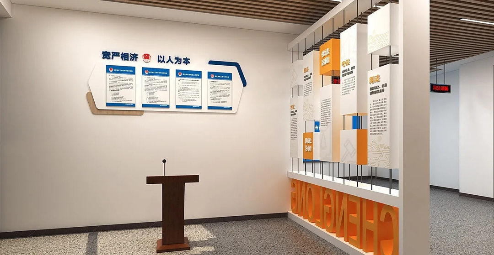

Recently, as the deputy leader of a working group, I conducted an inspection at a county-level judicial bureau for a month. Since the group leader only attended two events at the beginning and end, I was essentially in charge of the entire inspection process on-site. <!--more-->

> At the end of 2012, I unexpectedly started working at a county-level judicial bureau in Guangdong and spent 21 wonderful months there, which left me with a very positive impression of the job. Based on this experience, after being transferred out in 2014, I continued to pay close attention to the judicial bureau in my work. I maintained good working relationships with both the local judicial bureau leadership and many ordinary staff members, gaining a deep familiarity with various aspects of the bureau's work and understanding many of the daily issues they face.

This inspection of the judicial bureau was conducted in accordance with the inspection outline and my personal experience. Particularly in identifying potential issues in the bureau's daily operations, I followed a pre-set checklist to verify the occurrence of problems. The entire process was relatively smooth for the working group, allowing us to complete the task efficiently and successfully. The resulting report was of good quality, at least in terms of length, as it was significantly longer than reports from previous inspections at other units.

---

## First Impressions of the Judicial Bureau

My first interaction with the judicial bureau was in 2009. Before that, I had only heard of the bureau but had no idea what it actually did.

Around December 2009, as part of a college arrangement, we participated in the annual December 4th Legal Awareness Day as volunteer legal educators. Through this interaction, I learned about the judicial bureau's first function: legal education. At the time, I even kept a simple journal *[First Legal Advocacy](https://lawtee.com/article/2009-12-06-legal-advocacy/)*.

Looking back at that experience, I can sum it up in three words: **idealistic**. Our initial plan was to educate homeless people about the law.

> The target audience for the survey was strictly limited to homeless individuals; the time was set from 8:30 AM to 5:00 PM on December 4th; the location was downtown Foshan. The content focused on basic legal concepts, how laws and regulations could help homeless individuals, and crime prevention. The method involved small groups of two or three members conducting scattered outreach, with each group required to reach at least 30 people. The process required audio-visual tools for verification, followed by a summary after the outreach.

To put it nicely, legal education work is "idealistic." To put it bluntly, it's hard to make it "grounded." This has always been the biggest challenge for judicial administration work. Most people's stereotypes about the judicial bureau stem from this, viewing its functions as "formalistic" and superficial.

However, only those who have experienced it firsthand know that the more superficial the work seems, the more uncertain it feels to execute. Perhaps only a truly "laid-back" or "unbothered" attitude can bring peace of mind.

---

## Impressions While Working in the Judicial Bureau

From November 2012 to July 2014, I worked in two departments at the judicial bureau, starting at a street-level judicial office and later moving to the legal education office. However, the overall experience in both roles was similar, which can be summarized as: good pay, few tasks, and light workload.

### Relatively High Salaries

Since judicial administrative organs fall under the political-legal unit category, and the majority of their staff are judicial police (prison and drug rehabilitation officers), county-level judicial bureaus benefit from this by using specialized political-legal staffing and following police standards.

> For a long time, judicial bureau staff have received political-legal subsidies and police rank allowances. Around 2013, I received about 600-700 yuan per month from these two allowances. At a time when civil servant salaries were generally low, earning a few hundred yuan more than peers was a significant advantage. After 2017, these two subsidies were merged and upgraded into a nationally unified 1200 yuan political-legal allowance.

This extra 1200 yuan significantly boosted the judicial bureau's appeal within the system, as a promotion in most places wouldn't even come close to a 1200 yuan raise. Compared to ordinary units, this was a considerable advantage.

However, this also easily sparked envy among peers. After all, within the political-legal units, courts, procuratorates, public security, and state security are all powerful entities with high salaries justified by their sacrifices and efforts. But the judicial bureau, as an ordinary administrative unit, why should it also receive subsidies?

### Relatively Simple Work

The judicial bureau has traditionally had few functions, mainly including people's mediation, legal education, notarization, legal aid, lawyer management, public lawyer offices, and community correction. Among these, notarization and community correction are things most people will never encounter in their lives, making the work relatively straightforward. Lawyer management and public lawyer offices depend on local economic development; in some places, a county might only have a few lawyers, so there's not much to manage. Legal aid, legal education, and people's mediation are all bottom-line service tasks. Overall, the work is indeed quite "superficial," leading many to view the bureau as a "**clean but idle office**."

### Mixed Quality of Personnel

Before joining the judicial bureau, I worked at a court in the core area of the Pearl River Delta, where the high quality of staff left a deep impression on me. Almost all colleagues were graduates of the "Five Institutes and Four Departments" or top universities, with a high proportion of master's degree holders, and the court president even held a Ph.D. in law. However, after moving to a county-level judicial bureau in the surrounding area of the Pearl River Delta, I was shocked to find that among the four people hired in my batch, we already made up half of the bureau's staff with undergraduate degrees or higher. Almost all bureau leaders and heads of internal departments and dispatched agencies had less than a college education.

---

## Impressions of the Judicial Bureau Since 2018

In the 2018 institutional reform, the judicial bureau's functions were significantly strengthened, with the Party's Rule of Law Office and the government's legal affairs office both being incorporated. Within the "Four Comprehensives" strategic layout, the judicial bureau is the only administrative unit responsible for "one comprehensive" aspect, covering an unprecedented breadth and depth of work. However, due to historical inertia, the bureau has struggled to adapt to its new role, and many functions remain underutilized. In daily work, the following impressions stand out:

### Lack of External Authority

In theory, as an important member of the political-legal organs, the judicial bureau's role as the "sword holder" is unquestionable. However, in daily operations, due to a lack of fighting spirit, self-deprecation is common. For example, in administrative reconsideration and litigation, many cases where administrative organs lose should involve accountability. When the legal affairs office was a separate entity, there was at least some restraint, but after being transferred to the judicial bureau, this work has been neglected—unwilling to manage or offend others. This phenomenon is even more pronounced in legal education, where many local judicial bureaus are eager to distribute exam answers to all government units, ensuring everyone scores 100%, turning it into pure formalism. The same applies to administrative mediation and adjudication, where the focus is on not offending anyone, letting things slide.

### Internal Conflicts

Years of civil service recruitment have significantly improved the talent pool in the judicial bureau. Many law graduates and those who have passed the bar exam now work there. Due to the relatively simple and light workload, many local leaders prioritize assigning their children (especially daughters) to the judicial bureau, leading to a significant increase in the number of "law-educated" individuals. However, this has also created a headache: everyone tends to seek self-serving rules, leading to internal conflicts.

> Comparatively, courts, procuratorates, and public security organs have more law-educated individuals, but this issue is less prominent, mainly for two reasons: first, the heavy workload leaves no energy for conflicts; second, the semi-military management fosters stronger discipline.

### Prevalence of Apathy and Inaction

During this inspection, I focused on the management of key populations. Given the complexity of social conflicts, groups such as individuals with severe mental disorders, drug addicts, homeless individuals, special minors, and ex-convicts are prone to causing trouble. In the government's functional division, the judicial bureau is responsible for coordinating the management of these groups, with ex-convicts directly under its supervision. However, a quick search on WeChat revealed that few local judicial bureaus actually take the lead in this work. Most still only focus on their community correction targets, failing even to manage post-release assistance effectively. Here are a few examples:

> 1. In preventing juvenile delinquency, the judicial bureau identifies post-release assistance targets based on the age at which minors are released from correctional facilities or prison, which in practice is almost always zero. Despite numerous responsibilities assigned to the judicial bureau in various juvenile delinquency prevention plans, in reality, little is done, completely mismatching the overall situation of juvenile crime prevention.

> 2. The core reason the judicial bureau struggles to identify juvenile post-release assistance targets is the significant gap between the information it holds and the actual situation. A quick search on WeChat shows many local judicial bureaus claiming zero recidivism among their post-release assistance targets in recent years. However, crimes like theft, robbery, and fraud have high recidivism rates, but the information on these ex-convicts is often not entered into the post-release assistance system by prisons or detention centers. As a result, the judicial bureau is largely working in a vacuum, focusing on low-recidivism individuals and achieving little in prevention.

> 3. The people's mediation work led by the judicial bureau is a major point of contention for courts, procuratorates, and especially the public security system. The core issue is the prevalence of "empty" mediation cases. While the bureau annually reports on the number of cases mediated and conflicts resolved, these cases often have little overlap with the rapidly growing types of litigation in courts. The mediation work has only a limited effect on reducing court caseloads. In urban development, disputes over property sales, rentals, and community management, as well as those involving various market entities, are rarely addressed by people's mediation, which remains stuck in the realm of rural neighborhood disputes.

> 4. Another important function of people's mediation is crime prevention, particularly preventing civil disputes from escalating into criminal cases. However, in practice, this function is largely ineffective, with most cases being "mediated and forgotten." Post-mediation, even the rate of reneging on agreements is not tracked, let alone preventing civil disputes from turning into lawsuits or crimes.

### Rigid Work Thinking

The main issue is that the 2018 institutional reform brought about a seismic shift in the judicial bureau's work. Before the reform, apart from the legal education office, which had a coordinating function, most of the bureau's work was single-task oriented. Post-reform, many of the bureau's functions shifted to coordination and guidance, such as comprehensive rule of law, building a law-based government, constructing a law-based society, supervising administrative law enforcement, administrative reconsideration and litigation, and managing key populations. These tasks can no longer be handled with a single-task mindset. Unfortunately, many local judicial bureaus have struggled to adapt.

---

During this inspection, I largely applied my stereotypes of the judicial bureau from the past five or six years to identify issues. Unsurprisingly, most of them were present. Although the degree varied, the overall impression is that the judicial bureau, as a political-legal unit, lacks authority and strength, with widespread ideological issues, lagging far behind courts, procuratorates, and public security organs.

> As one judicial bureau leader mentioned during our discussions: "Given the current state of the judicial bureau, if we were to take over court enforcement work one day, whether we could handle it would be a big question."