My grandmother had only three sisters, all born in the 1930s, and they all lived to a ripe old age. However, after my grandmother passed away earlier this year, we were struck by another misfortune—the death of her brother (my great-uncle). With this, among my grandparents' generation, only two relatives remain: my grandmother's younger sister (my great-aunt) and my grandfather's youngest sister-in-law (my great-aunt). <!--more-->

> Over the years, I have lost count of how many times I have returned home to attend funerals. From my grandfather's nine siblings to my maternal grandparents' siblings, and even some of my uncles and aunts, I have hardly missed any. Unless there were extremely pressing work commitments, I always made it a point to return home for these occasions.

---

Since childhood, I have held great admiration for this great-uncle. He was the first college graduate among all my relatives and one of the earliest college graduates after the founding of the People's Republic of China. He graduated from the Hunan People's Revolutionary University, where the founding general Huang Kecheng served as the president. I once heard him say that after graduation, he was assigned to work in Xiangtan, where he even had some interactions with Hua Guofeng, who was then the secretary of the Xiangtan Prefectural Committee. Later, to be closer to home, he transferred to Shuangfeng County, which had recently been separated from Xiangxiang County, and worked there until his retirement.

As a child, I loved visiting my great-uncle's home to browse through his collection of books, especially during the time he retired and lived in his old house in the mountain village. The village was about five or six miles of mountain trails from my home, and the entire journey required climbing. What left the deepest impression on me was his collection of "heavyweight" books like the "Cihai" and "Ciyuan." To my young eyes, these were the ultimate symbols of knowledge, making my "Xinhua Dictionary" seem almost childish in comparison.

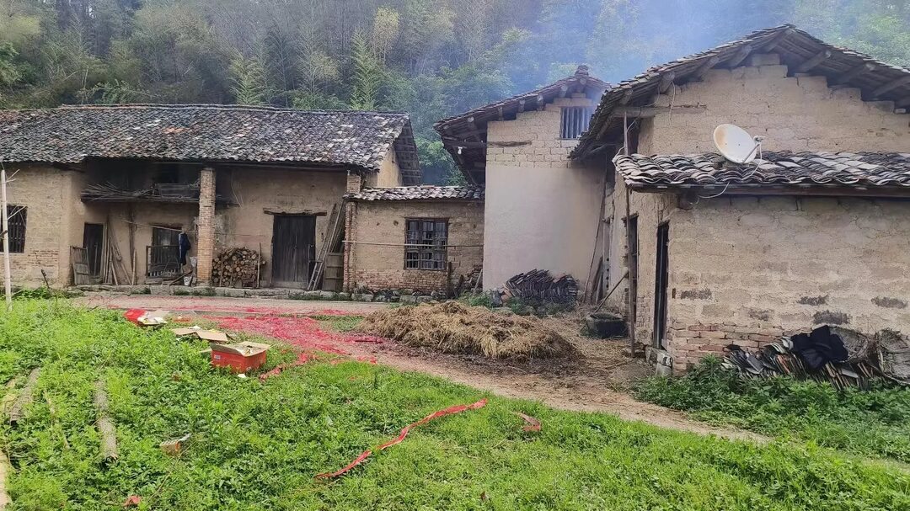

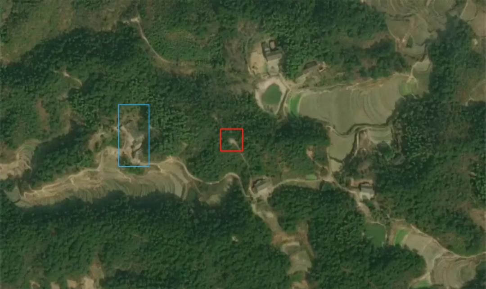

---

Around 2005, my great-uncle's family moved down from the mountains to the town, where they bought land next to the farmers' market and built two "storefront buildings." After that, I never visited his old mountain house again. Since this new house was much closer to my home, I often went there. As soon as you entered, you were greeted by walls covered in calligraphy and paintings, mostly created by my great-uncle's local friends.

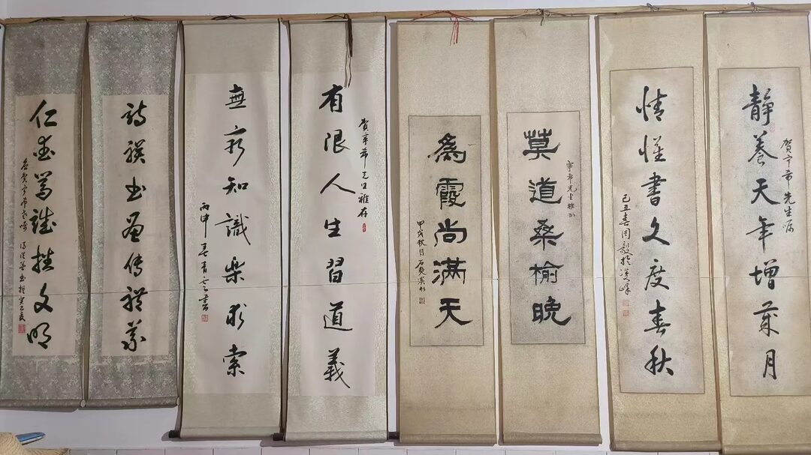

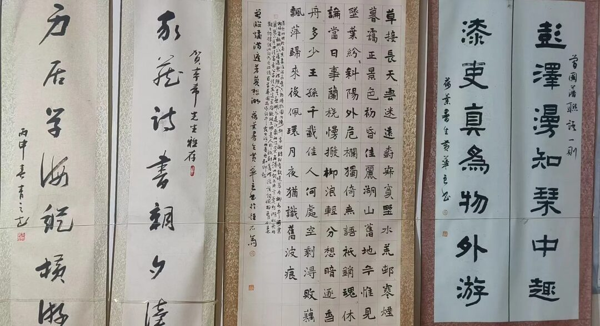

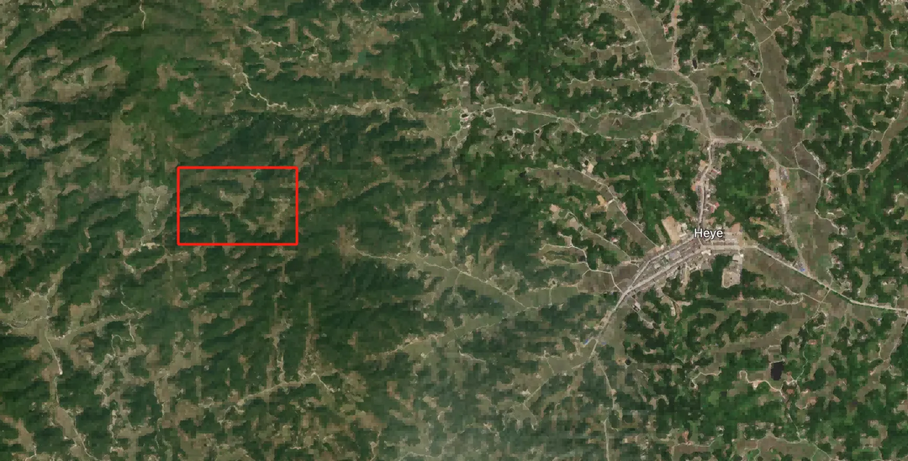

---

By around 2013, because my great-uncle's children were all working in the county town, he purchased an old-style "cadre's apartment" in the old government compound of Shuangfeng County to spend his retirement. I would visit him there every year. Each time, he would show me some of the research he had been doing after retirement, but honestly, I couldn't make sense of any of it.

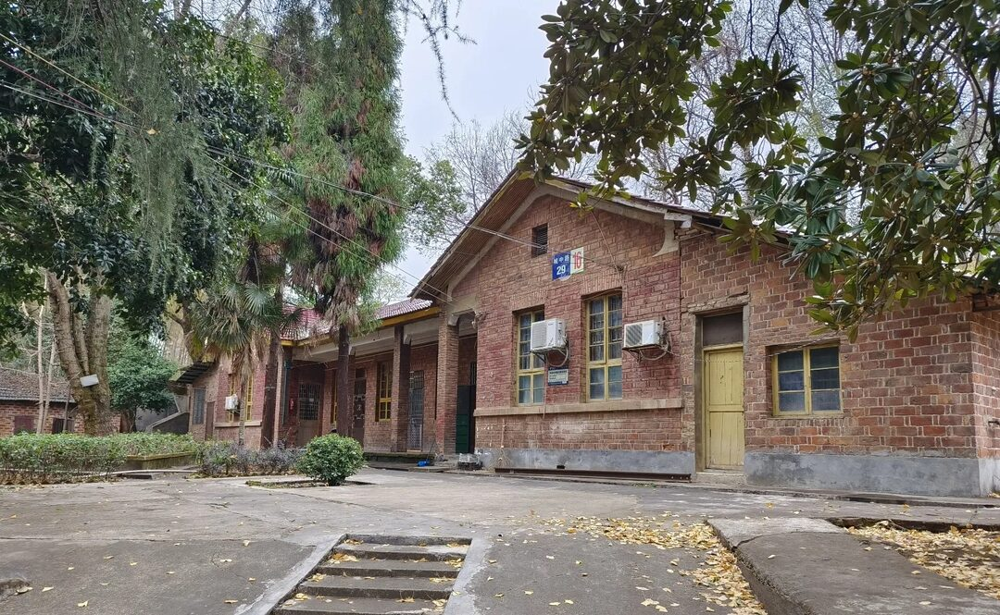

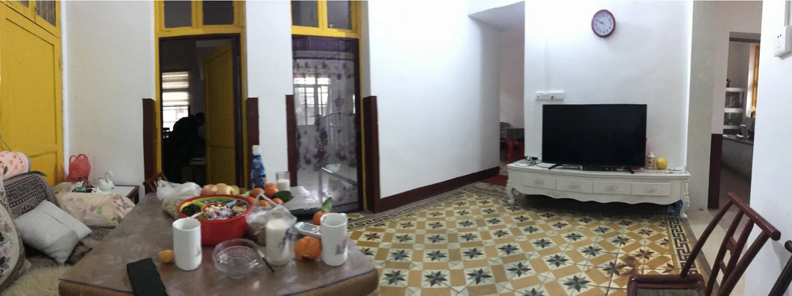

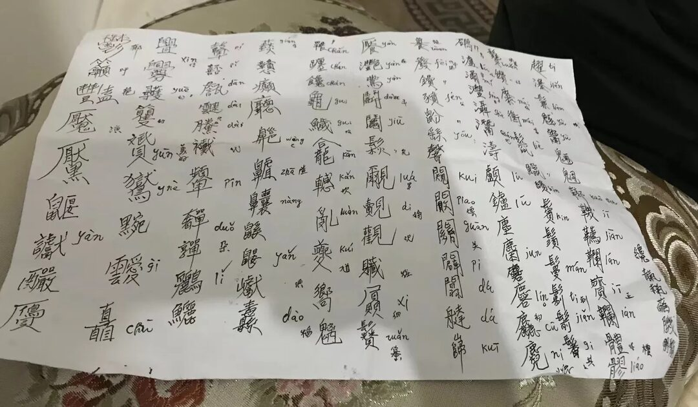

---

> Earlier this year, when my grandmother passed away, my great-uncle returned from the county town several times. He even came to help write couplets for my cousin's wedding at the end of last year. I always thought he was in good health, so I was truly shocked to hear the sad news of his passing so soon.

This funeral was indeed a challenging one. The main ceremony was held at the storefront building in the town, while the burial site was on the hill behind the old mountain house. This made many aspects of the process quite inconvenient. Particularly, when we were carrying my great-uncle's coffin up the mountain, we had to first transport it by truck to the foot of the mountain and then walk up a long-abandoned dirt path. Fortunately, some people had repaired the path beforehand; otherwise, it would have been nearly impossible to traverse.

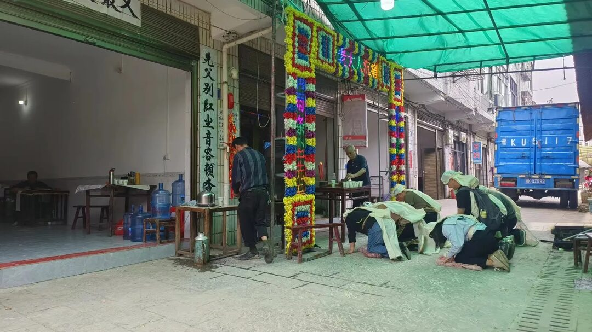

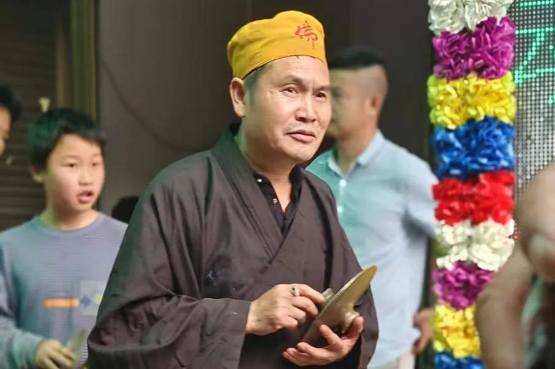

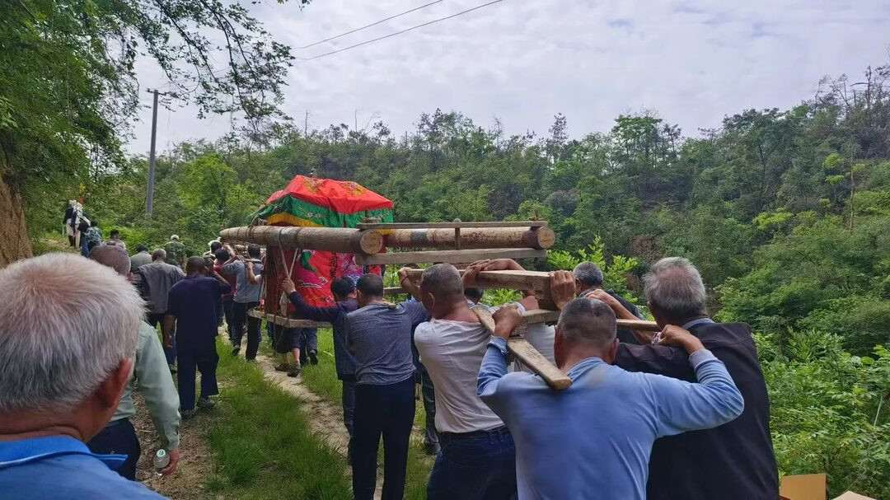

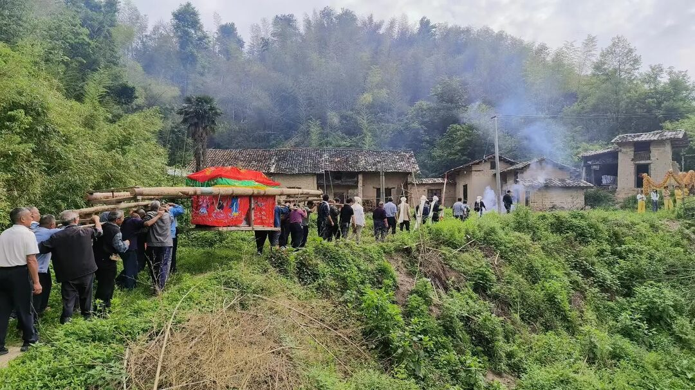

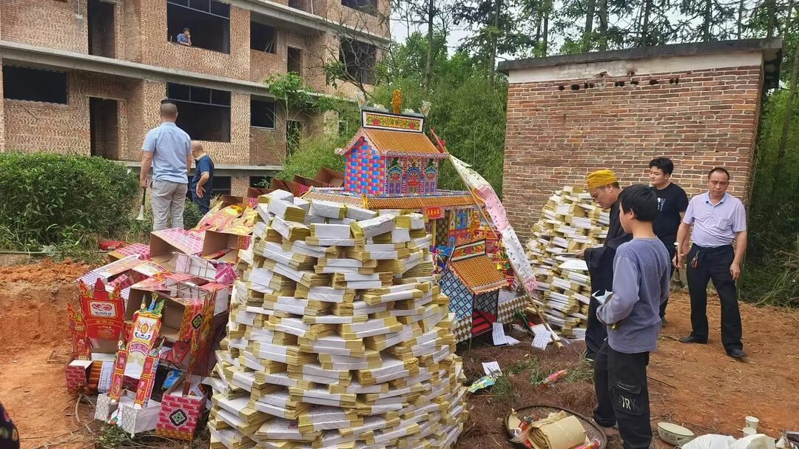

---

Though the person is gone, their spirit lives on.