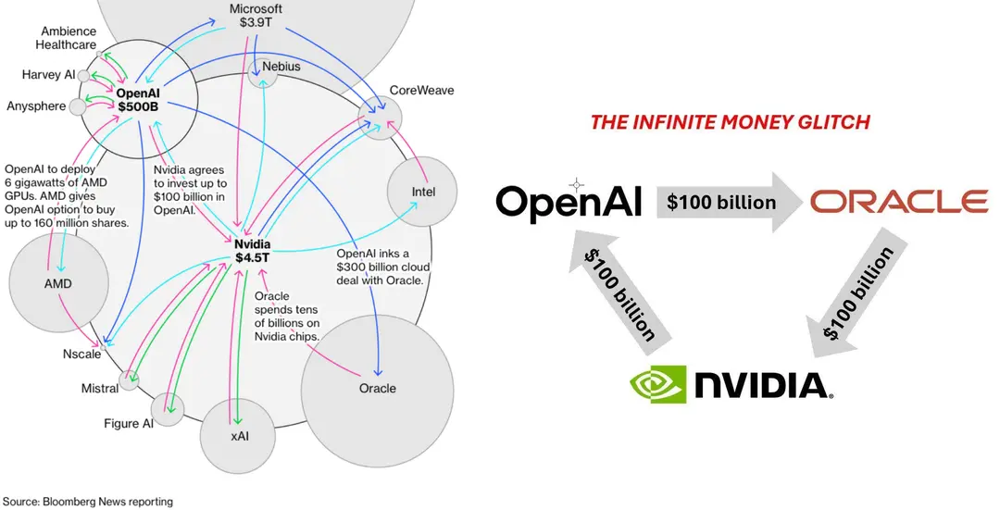

昨天刷知乎，看到一个问题："如何评价「AI就是美国的城投」的观点？" 这个问题下提供了一张图，也就是最近在互联网上被广泛传播的那张描绘AI投资关系的网络图，它展示了科技巨头 Nvidia、OpenAI、Microsoft 和Oracle 之间错综复杂的资金流动和合作，号称“**AI永动机**”。有人据此质疑，这种完全的“内循环”是否构成了一个巨大的资产泡沫，并将AI比作“美国的城投”，最终可能崩盘。<!--more-->

我认为这个问题中的比喻还算保守了，于是也在下边写了个回答。总体上看，我认为在中美科技竞争的背景下，美国现在这种AI搞法，**更像是给自己挖的“第二个反恐战争”坑**，不仅代价高昂、收益递减，还严重分散国力。

### 反恐战争的战略代价

2001 年 9·11 事件后，美国发动全球反恐战争，深陷中东泥潭长达 20 年。根据布朗大学的研究，这场战争的总支出超过8万亿美元，包括军事行动、重建和相关开支。

这些资金本可以用于美国基础设施、教育或科技研发，却被用于一场旷日持久的冲突。结果呢？美国国力消耗巨大，债务激增，而中国则抓住这个战略窗口期，快速发展经济和科技。到奥巴马政府2011年宣布“重返亚太”时，其实已经晚了。中国已从制造业大国向科技强国转型，奠定了今天的竞争力。

这场战争对美国的教训在于，**高额投入不等于战略胜利**。如果方向偏差，再多钱也只是烧掉资源。反恐战争表面上是为了美国所谓的国家安全，但实际分散了注意力，让自己陷入被动。

### AI热潮正在重演反恐剧本

如今，美国的AI热潮正上演类似一幕。

从2024年的数据看，美国私人 AI 投资已达 1091 亿美元，几乎是中国的 10 倍。进入 2025 年，微软、Alphabet、Meta 和亚马逊等巨头宣布的资本支出总额更是高达 3700 亿美元，而且还在指数级增长中，这些数字完全不亚于再打一场全球反恐战争的规模。

但这些钱绝大多数砸在了哪里？**语言交互层**。

我这两年几乎每天都在高强度使用各种新的 AI 工具，个人感觉这些工具的核心价值就是解决一个问题：**语言到语言的翻译**。更准确地说，是把人类自然语言翻译成“机器能懂的语言”（如代码、API调用、数据表、向量等），再把程序和机器翻译回人类能懂的语言。

**这实际上是在为美国主导的第三次工业革命“擦屁股”**：过去几十年，各国程序员发明了无数种“反人类”的编程语言，导致普通人被挡在门外。现在的 AI，则在“纠偏”，让普通人都能用人类语言指挥程序和机器。

问题在于，美国资本大多把筹码压在了前半段，即用 AI 指挥程序。

从人类语言直接生成更多、更好、更快的信息内容，不管是文本、图片、视频还是代码。

可是 IT 互联网这些年发展下来，连退休老太太每天都能刷上 10 小时短视频了，搞再多 AI 造出来的“垃圾数据”又有啥用呢？

### AI的本质是工具而非目的

需要强调的事，**AI 的本质是一种工具**。用工具产出内容，显然是内容对消费者更重要，而不是工具本身更重要。

想想看，AI 生成的内容再多，如果缺乏原创性和深度，消费者为什么买账？

就像一个锤子再先进，如果只用来敲钉子，却敲不出有价值的东西，最终还是闲置。

当前AI热潮中，许多投资聚焦于生成式 AI，如 ChatGPT 或图像生成器，这些确实提高了效率。但它们更多是“内容工厂”，而非革命性生产力工具。

更重要的是，**人类天然对“垃圾数据”反感**。

如果一味由 AI 产出内容，相信就算最无聊的退休老太太，也没啥兴趣去消费。毕竟，只要是个正常人，看到抖音、视频号上刷到的是 AI 视频，第一反应就是滑走了。

### 中美AI赛道分化

造 AI 产品，本质上是想让普通人省去学习成本，也能**享受“当老板”指挥程序和机器干活的快感**，也就是俗称的可以“动口不动手”就能把问题解决。

但就现实世界来说，美国的 AI 投资主要聚焦在前半段，押注在“老板”与“中层”这个环节，**通过动嘴皮子做好 PPT。**

而对于真正能撬动生产力进步的环节，如何将轻易就能做出来的 PPT 落实到基层员工的生产制造、落实到与现实世界的交互，目前来看，美国无论是现实投资方向，投资动力还是投资土壤，都存在显著障碍。

这个领域，恰好就是目前中国在悄悄发力的方向。

中国坚定发展实体经济，十五五建议中更是毫无悬念的把制造强国摆在强国战略的首位。

如果从 AI 到制造业这个后半段道被中国跑通，美国这次可能不是失去 10 年的事，而是直接丢掉整个 21 世纪的制造业主导权。
