Recently, Old T wrote an article titled "[Why 1000M Broadband Sometimes Tests at Only 300M](/article/why-1000m-bandwith-tesed-300m/)," and some readers privately messaged Old T asking how to optimize their home networks. Old T thought, isn't network optimization something you can find everywhere online? So, he casually searched for a few articles on WeChat Official Accounts and sent them over. But clearly, these didn't meet their needs because their goal was to optimize upload issues with cloud storage, where uploads would often disconnect midway. Thus, Old T had no choice but to write this article himself. Coincidentally, he's also been pondering video website compression upgrades and static website solutions, so he'll cover those as well.<!--more-->

First and foremost, it's important to emphasize that this article is based on optimizing the network as much as possible without additional costs, leveraging the performance of existing devices, and achieving optimization through tuning. However, before diving into specific methods, Old T must first explain the principles behind this "optimization" using a few examples.

---

## Main Principles of Home Network "Optimization"

### First Principle: "Playing Nice" in Front of ISPs

As mentioned at the end of my previous article "Why 1000M Broadband Sometimes Tests at Only 300M," in 2025, while gigabit broadband has become the norm and 10-gigabit is gradually spreading, the overall upper limit of ISP network bandwidth hasn't increased significantly. If users collectively and continuously consume high bandwidth, it will inevitably cause network congestion, drastically degrading the experience for all users. Therefore, major ISPs impose restrictions on user behavior.

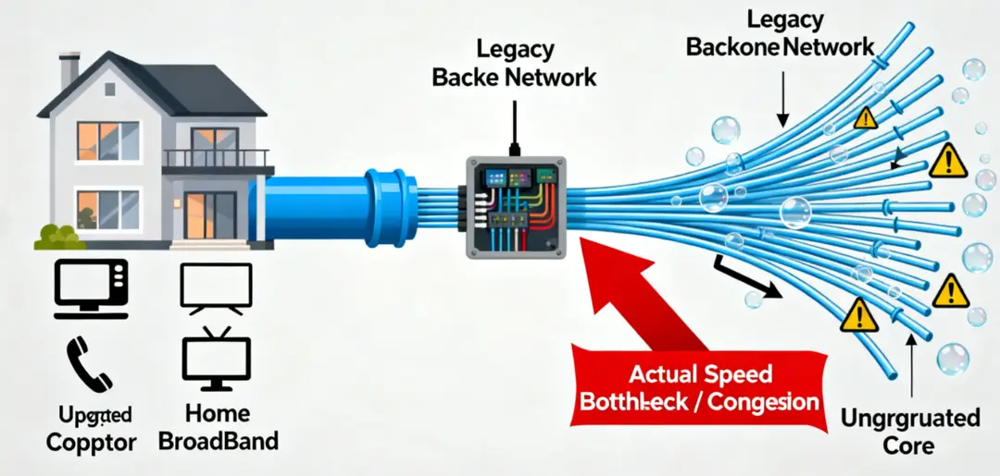

For example, according to the National IPv6 Development Monitoring Platform, China's total IPv6 export bandwidth is only 11,320 Gbps. In other words, if 11,000 users simultaneously max out their gigabit IPv6 traffic for external communication, the national IPv6 import/export network would become congested. Considering the vast scale of 1 billion internet users, the per capita bandwidth resources are actually very limited.

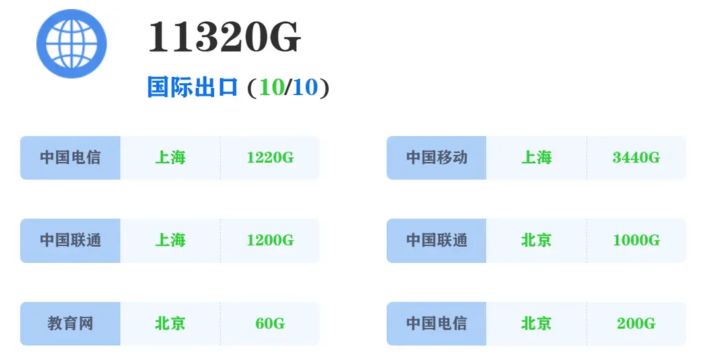

Based on this, ISPs have developed "identification models" to accurately pinpoint "troublemaker users." For instance, Old T recently saw in a WeChat group a疑似 user agreement from a provincial telecom operator stating that if a single broadband account exceeds 10 GB of daily upload traffic or accesses out-of-province IPs/DNS 10,000 times per month, it would be considered PCDN traffic, potentially leading to restrictions or suspension of the broadband account.

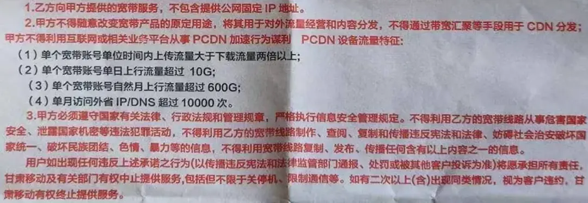

But honestly, such restrictions are overly harsh. For example, if Old T's phone has 50 GB of photos and videos and he decides to upload them to cloud storage one day, he might face broadband account restrictions, which seems a bit unfair.

### Second Principle: Optimizing Network Latency

Last year, Old T wrote an answer on Zhihu about a video website's extreme compression of video quality, which garnered over 200,000 reads and 2,000+ upvotes. That question mainly discussed how, in recent years, various video platforms have been pushing more advanced compression schemes like HEVC and AV1 encoding, which can compress 4K video to 1-2 Mbps while remaining clear.

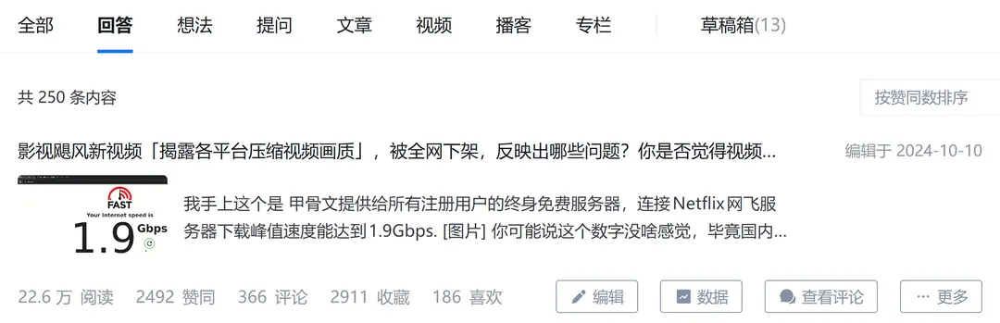

This means that daily internet usage doesn't actually require high bandwidth nowadays. However, since these video compression technologies heavily rely on real-time decoding by computer and phone chips, they indirectly place higher demands on network latency. If latency is high, the first frame of a video loads slowly, buffering becomes frequent, and the experience plummets.

In this era of "lightweight" data where daily usage feels the impact most, optimizing network latency is often more practical than pursuing higher bandwidth. The core principle is to reduce the "Round-Trip Time" (RTT), ensuring data packets arrive faster and lightweight videos start instantly.

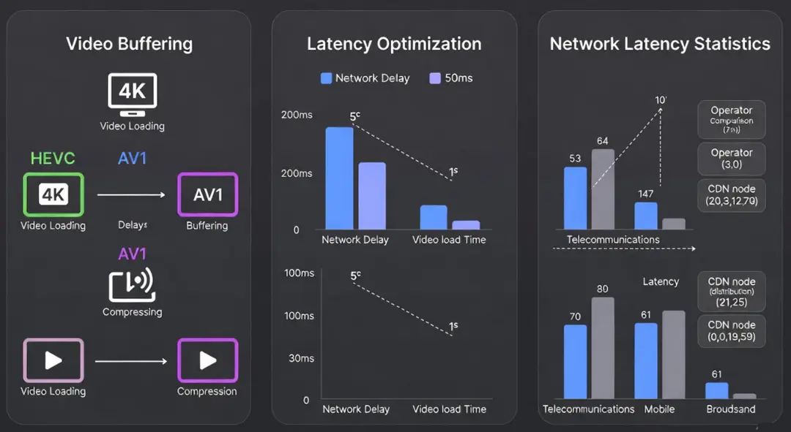

### Third Principle: Optimizing Network Routes

This is a long-standing issue. For home networks, it boils down to choosing among telecom operators like China Telecom, China Mobile, China Unicom, and China Radio and Television. For example, Old T previously set up a cloud storage application on a server in Hong Kong (Alibaba Cloud), but the server's data center uses international routes. Only China Mobile offered fast speeds, while Unicom and Telecom had to route overseas and back, resulting in unbearably slow speeds.

Even though Old T's home is only about 100 kilometers from Hong Kong—theoretically, light could travel that distance in under 1 ms—some routes detour halfway around the world, slowing things down many times over. With data traveling such long distances through countless network devices, packet loss and snail-paced speeds are hardly surprising.

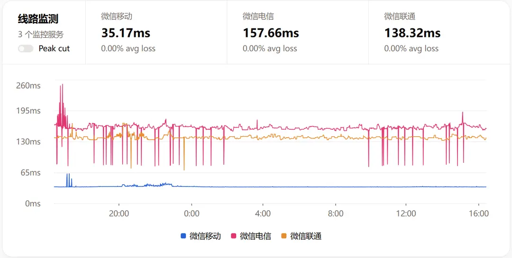

Routes are one of the most critical aspects of network hardware. Different ISPs have varying backbone networks and server node distributions. Choosing one that matches your usage scenario can reduce hop counts and latency. For instance, referring back to the IPv6 bandwidth data image, it's clear that among the three major national import/export nodes, Shanghai Mobile's IPv6 export is 3440 G, while Beijing Telecom's is only 200 G. If you need to use IPv6 import/export routes, it's best to choose Mobile near Shanghai and Unicom near Beijing.

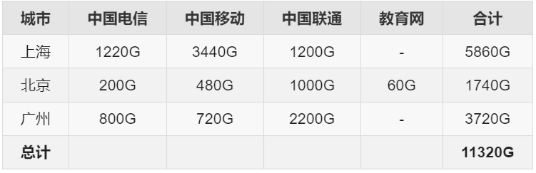

---

## Main Methods for Home Network Optimization

Based on the above three principles, if you want to optimize your home network, Old T doesn't recommend hastily replacing your router or upgrading your broadband. Below are techniques Old T has tested and found effective, all operable on existing devices or optimizable without additional investment. Methods are categorized by the aforementioned principles but can be used in combination.

### "Playing Nice" in Front of ISPs to Avoid Restrictions  

**1. Proactively Set Up QoS**  

If your router was purchased in the last few years, it likely has built-in QoS functionality. In the router's backend (usually 192.168.1.1), limit the upload bandwidth to 80% of the actual value. Then, enable an appropriate QoS mode to somewhat improve the network experience.

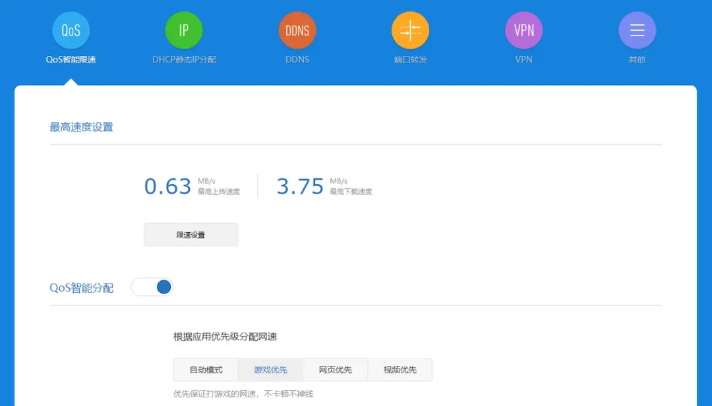

**2. Control Cloud Storage Uploads**  

Most cloud storage software has built-in speed limiting features. If you need to upload large amounts of data, set the upload time to between 23:00 and 7:00 in the cloud storage settings. Additionally, try to limit upload speeds during the 6 PM to 11 PM period. Continuous full-speed uploads during this time are most likely to trigger ISP QoS, affecting other network services.

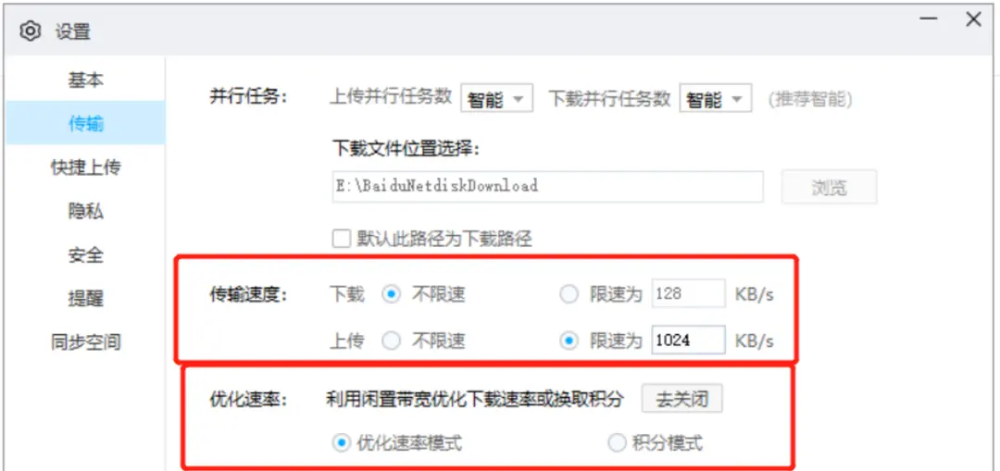

**3. Set Up NAS Scheduled Tasks**  

When using NAS to upload data to cloud storage, employ scheduled upload strategies as much as possible. Adhere to the general standards ISPs use to identify PCDN in your area, ensuring daily uploads stay within limits. For example, if the local upload limit is 100 GB per day and your upload bandwidth is 30 Mbps, try not to exceed 8 hours of upload per day.

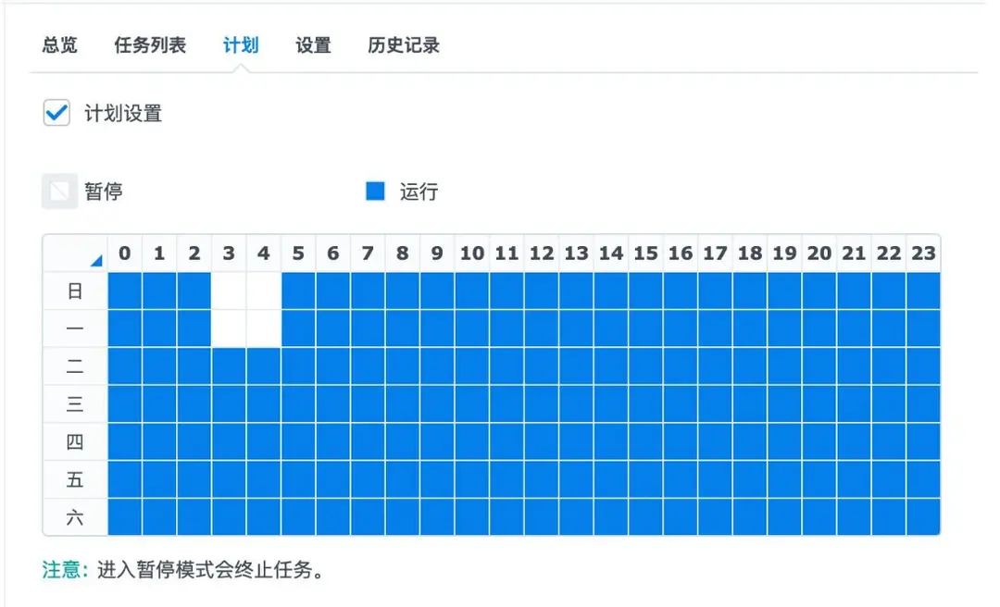

**4. Windows Optimization**  

Mainly, disable the "Delivery Optimization" setting in Windows Update, or set it to limit the total upload data. This "Delivery Optimization" function is essentially similar to PCDN, as it uses user bandwidth to upload Windows update packets to other users needing updates.

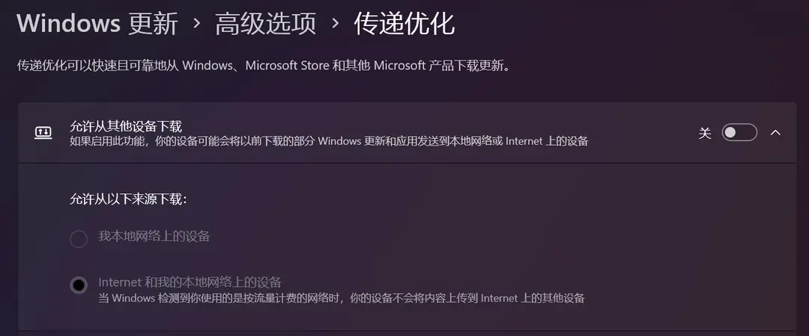

**5. Phone Tuning**  

Turn off the "Wi-Fi and mobile data simultaneously" feature on your phone. In poor network conditions, this feature can cause the phone to frantically access out-of-province DNS. In areas with strict PCDN restrictions, you might unknowingly trigger penalties.

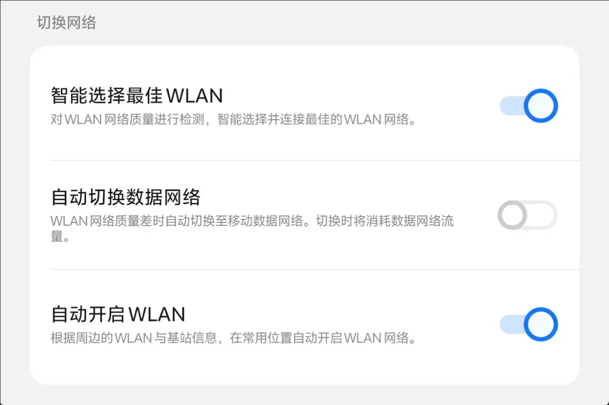

### Optimizing Network Latency for Stable Connections  

**6. Change to a Stable DNS**  

Currently, in China, DNS services that combine speed and stability mainly include Alibaba Cloud's 223.5.5.5 and 223.6.6.6. Changing the router's primary DNS to Alibaba Cloud DNS can significantly resolve some inexplicable connection issues in the home network. If Alibaba Cloud DNS is still slow in your specific area, use the Ping command locally to test various public DNS options and choose the fastest one, such as Tencent's 119.29.29.29, Baidu's 180.76.76.76, or ByteDance's 180.184.1.1.

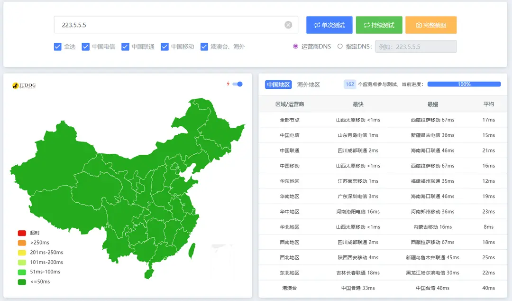

**7. Separate Wi-Fi Bands**  

Avoid using the "smart networking" mode in Wi-Fi routers. Instead, completely separate the 2.4 GHz and 5 GHz bands in your home Wi-Fi hotspot. For smart home devices like refrigerators, air conditioners, washing machines, security cameras, robot vacuums, water heaters, and water purifiers, use the 2.4 GHz band. For devices with higher network demands like laptops, phones, and TVs, use the 5 GHz band. The 2.4 GHz band is often heavily interfered with, so assigning "interference-resistant" slow devices to this band can significantly improve the network environment.

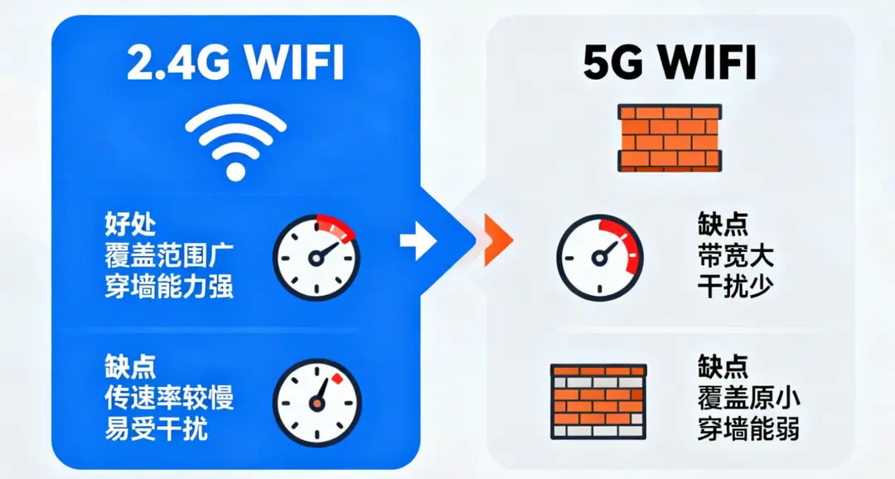
  

**8. Schedule Regular Reboots for Modem and Router**  

Log into the modem and router management pages to set up scheduled reboots, typically between 3-4 AM, which usually won't disrupt household usage. This mainly addresses the slowdown caused by accumulated cache data during operation, especially piled-up NAT table data. Often, when the network is slow, people hastily reboot the router, which not only affects the user experience but can also lead to data loss. Setting a scheduled reboot is a better approach.  

**9. Organize Ethernet Cables and Fiber Optics**  

As mentioned in Old T's article "Why 1000M Broadband Sometimes Tests at Only 300M," Ethernet cables, and particularly fiber optics, can impact the network. Many commenters have encountered similar issues. The key is to avoid twisting or knotting fiber optics and to promptly check for dirty or damaged Ethernet cable connectors.

### Optimizing Route Selection by Choosing the Right ISP  

**10. Comprehensive ISP Selection**  

Regarding ISP selection, Old T can't offer too much advice here, as it requires considering factors like cost, existing mobile or family plans, and regional differences.

Generally, it depends on personal usage scenarios. If you mainly use popular platforms like WeChat, QQ, Douyin, or Bilibili, any ISP will do, as internet companies strive to optimize the experience for all users. If you frequently access international resources, refer to third-party tools (like various multi-location Ping test websites) to check the actual latency and packet loss from your location to the target server. If there are clear comparative test reports between different ISPs in your area, prioritize feedback from local users.  

Finally, Old T wants to emphasize that in the journey of network route selection, it's an ongoing process, not a one-time task, and certainly not a simple case of "you get what you pay for." Researching and comparing based on your actual needs is the optimal solution.